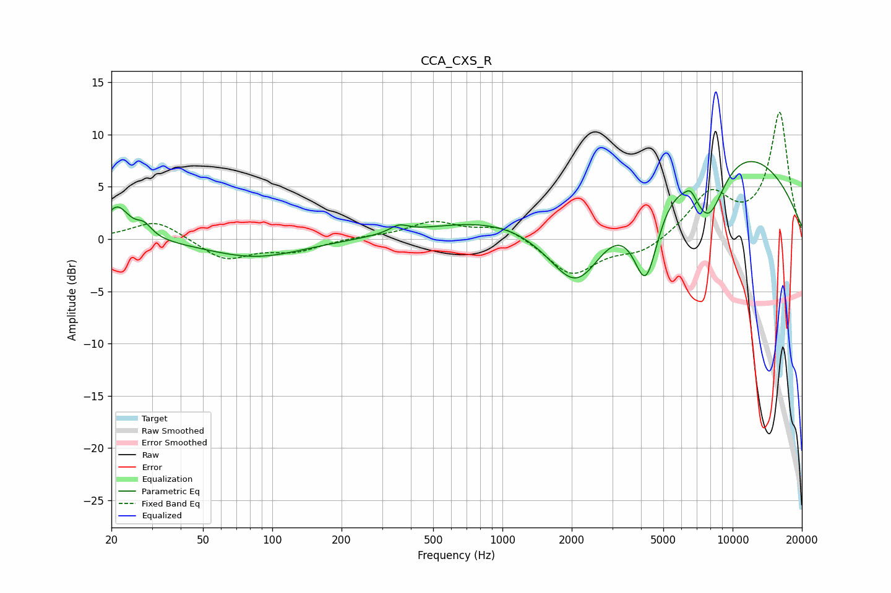

# CCA_CXS_R
See [usage instructions](https://github.com/jaakkopasanen/AutoEq#usage) for more options and info.

### Parametric EQs
Apply preamp of -7.5 dB when using parametric equalizer.

|   # | Type    |   Fc (Hz) |    Q |   Gain (dB) |
|-----|---------|-----------|------|-------------|
|   1 | Peaking |        21 | 2.74 |         3.1 |
|   2 | Peaking |        28 | 4.2  |         1.1 |
|   3 | Peaking |        85 | 0.68 |        -1.8 |
|   4 | Peaking |       355 | 3.51 |         0.7 |
|   5 | Peaking |      1740 | 0.31 |         3.2 |
|   6 | Peaking |      2113 | 0.89 |       -11.1 |
|   7 | Peaking |      4202 | 2.28 |        -9.4 |
|   8 | Peaking |      6578 | 5.98 |         0.8 |
|   9 | Peaking |      7620 | 0.25 |        10   |
|  10 | Peaking |      7838 | 1.73 |        -6.7 |

### Fixed Band EQs
When using fixed band (also called graphic) equalizer, apply preamp of **-12.2 dB** (if available) and set gains manually with these parameters.

|   # | Type    |   Fc (Hz) |    Q |   Gain (dB) |
|-----|---------|-----------|------|-------------|
|   1 | Peaking |        31 | 1.41 |         1.9 |
|   2 | Peaking |        62 | 1.41 |        -2   |
|   3 | Peaking |       125 | 1.41 |        -1.1 |
|   4 | Peaking |       250 | 1.41 |         0.2 |
|   5 | Peaking |       500 | 1.41 |         1.6 |
|   6 | Peaking |      1000 | 1.41 |         1.3 |
|   7 | Peaking |      2000 | 1.41 |        -3.5 |
|   8 | Peaking |      4000 | 1.41 |        -1.3 |
|   9 | Peaking |      8000 | 1.41 |         4.2 |
|  10 | Peaking |     16000 | 1.41 |        12   |

### Graphs

