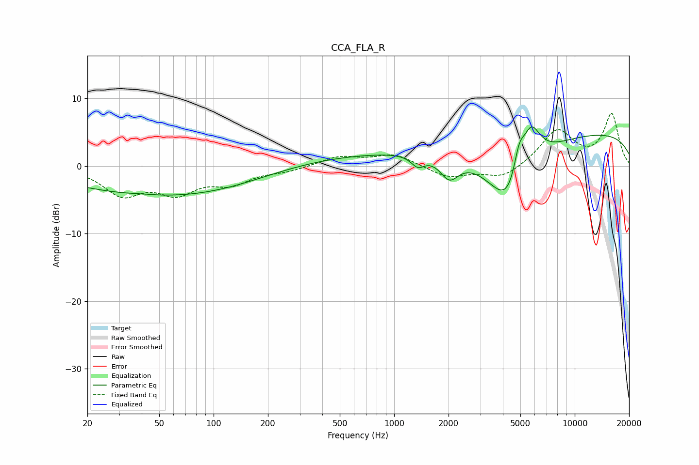

# CCA_FLA_R
See [usage instructions](https://github.com/jaakkopasanen/AutoEq#usage) for more options and info.

### Parametric EQs
Apply preamp of -5.9 dB when using parametric equalizer.

|   # | Type    |   Fc (Hz) |    Q |   Gain (dB) |
|-----|---------|-----------|------|-------------|
|   1 | Peaking |        40 | 2.15 |         0.1 |
|   2 | Peaking |        48 | 0.28 |        -4.1 |
|   3 | Peaking |       140 | 0.44 |        -1.3 |
|   4 | Peaking |       555 | 0.19 |         1.9 |
|   5 | Peaking |      1354 | 3.79 |        -1.6 |
|   6 | Peaking |      2022 | 2.7  |        -3.3 |
|   7 | Peaking |      4372 | 1.1  |       -11.1 |
|   8 | Peaking |      4913 | 4.48 |         4.3 |
|   9 | Peaking |      5715 | 2.47 |         6.9 |
|  10 | Peaking |     10000 | 0.18 |         5.2 |

### Fixed Band EQs
When using fixed band (also called graphic) equalizer, apply preamp of **-7.9 dB** (if available) and set gains manually with these parameters.

|   # | Type    |   Fc (Hz) |    Q |   Gain (dB) |
|-----|---------|-----------|------|-------------|
|   1 | Peaking |        31 | 1.41 |        -4   |
|   2 | Peaking |        62 | 1.41 |        -3.5 |
|   3 | Peaking |       125 | 1.41 |        -2.2 |
|   4 | Peaking |       250 | 1.41 |        -0.6 |
|   5 | Peaking |       500 | 1.41 |         1.4 |
|   6 | Peaking |      1000 | 1.41 |         1.7 |
|   7 | Peaking |      2000 | 1.41 |        -1.7 |
|   8 | Peaking |      4000 | 1.41 |        -1.9 |
|   9 | Peaking |      8000 | 1.41 |         5.3 |
|  10 | Peaking |     16000 | 1.41 |         7.6 |

### Graphs

