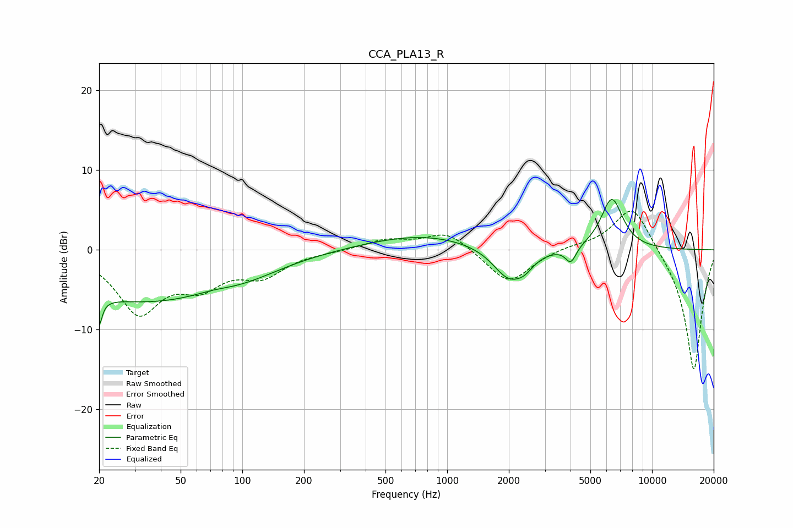

# CCA_PLA13_R
See [usage instructions](https://github.com/jaakkopasanen/AutoEq#usage) for more options and info.

### Parametric EQs
Apply preamp of -6.4 dB when using parametric equalizer.

|   # | Type    |   Fc (Hz) |    Q |   Gain (dB) |
|-----|---------|-----------|------|-------------|
|   1 | Peaking |        20 | 5.98 |        -6.9 |
|   2 | Peaking |        20 | 5.88 |         3.3 |
|   3 | Peaking |        32 | 0.35 |        -6.2 |
|   4 | Peaking |        72 | 1.48 |         0.5 |
|   5 | Peaking |        97 | 0.7  |        -1.5 |
|   6 | Peaking |       755 | 0.52 |         1.9 |
|   7 | Peaking |      1990 | 1.81 |        -3.9 |
|   8 | Peaking |      2381 | 3.07 |        -1.2 |
|   9 | Peaking |      4014 | 5.39 |        -2   |
|  10 | Peaking |      6367 | 2.55 |         6.4 |

### Fixed Band EQs
When using fixed band (also called graphic) equalizer, apply preamp of **-4.9 dB** (if available) and set gains manually with these parameters.

|   # | Type    |   Fc (Hz) |    Q |   Gain (dB) |
|-----|---------|-----------|------|-------------|
|   1 | Peaking |        31 | 1.41 |        -7.5 |
|   2 | Peaking |        62 | 1.41 |        -3.7 |
|   3 | Peaking |       125 | 1.41 |        -2.9 |
|   4 | Peaking |       250 | 1.41 |        -0.2 |
|   5 | Peaking |       500 | 1.41 |         1.2 |
|   6 | Peaking |      1000 | 1.41 |         2.3 |
|   7 | Peaking |      2000 | 1.41 |        -4.3 |
|   8 | Peaking |      4000 | 1.41 |         0.4 |
|   9 | Peaking |      8000 | 1.41 |         6   |
|  10 | Peaking |     16000 | 1.41 |       -15.4 |

### Graphs

