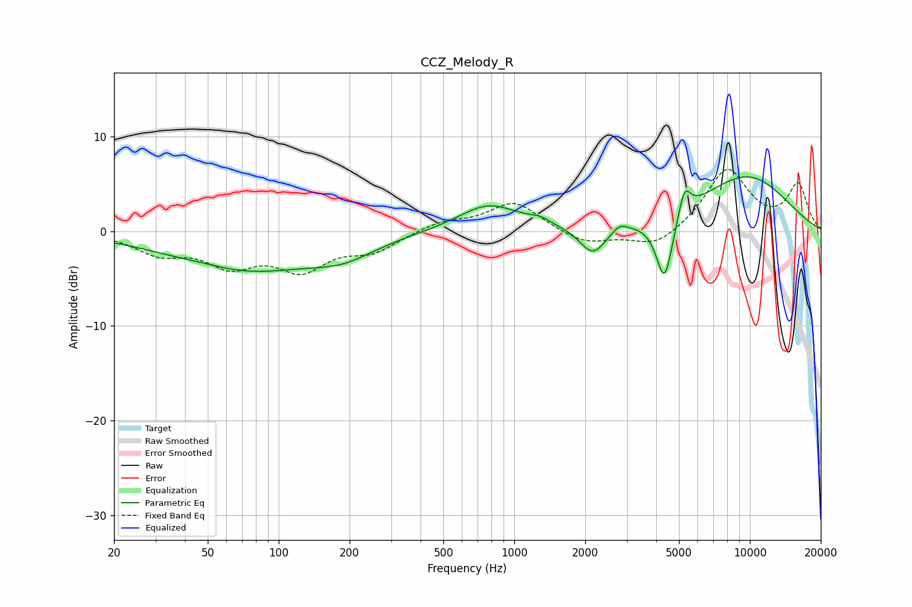

# CCZ_Melody_R
See [usage instructions](https://github.com/jaakkopasanen/AutoEq#usage) for more options and info.

### Parametric EQs
Apply preamp of -5.8 dB when using parametric equalizer.

|   # | Type    |   Fc (Hz) |    Q |   Gain (dB) |
|-----|---------|-----------|------|-------------|
|   1 | Peaking |        49 | 1.5  |         0.3 |
|   2 | Peaking |        72 | 0.46 |        -4.1 |
|   3 | Peaking |       188 | 1.06 |        -1.6 |
|   4 | Peaking |       778 | 1.09 |         2.9 |
|   5 | Peaking |      1289 | 3.1  |         0.6 |
|   6 | Peaking |      2157 | 2.52 |        -3   |
|   7 | Peaking |      2800 | 4.42 |         0.8 |
|   8 | Peaking |      4343 | 3.91 |        -7.1 |
|   9 | Peaking |      5273 | 5.31 |         3   |
|  10 | Peaking |      9614 | 0.6  |         5.8 |

### Fixed Band EQs
When using fixed band (also called graphic) equalizer, apply preamp of **-6.6 dB** (if available) and set gains manually with these parameters.

|   # | Type    |   Fc (Hz) |    Q |   Gain (dB) |
|-----|---------|-----------|------|-------------|
|   1 | Peaking |        31 | 1.41 |        -2.1 |
|   2 | Peaking |        62 | 1.41 |        -3.2 |
|   3 | Peaking |       125 | 1.41 |        -3.6 |
|   4 | Peaking |       250 | 1.41 |        -1.9 |
|   5 | Peaking |       500 | 1.41 |         1   |
|   6 | Peaking |      1000 | 1.41 |         3.1 |
|   7 | Peaking |      2000 | 1.41 |        -1.4 |
|   8 | Peaking |      4000 | 1.41 |        -1.9 |
|   9 | Peaking |      8000 | 1.41 |         6.5 |
|  10 | Peaking |     16000 | 1.41 |         4.8 |

### Graphs

