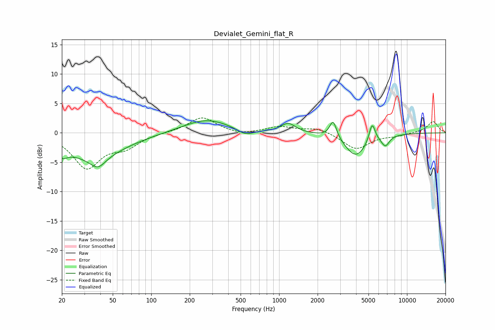

# Devialet_Gemini_flat_R
See [usage instructions](https://github.com/jaakkopasanen/AutoEq#usage) for more options and info.

### Parametric EQs
Apply preamp of -2.2 dB when using parametric equalizer.

|   # | Type    |   Fc (Hz) |    Q |   Gain (dB) |
|-----|---------|-----------|------|-------------|
|   1 | Peaking |        20 | 3.39 |        -1.6 |
|   2 | Peaking |        35 | 0.6  |        -4   |
|   3 | Peaking |        38 | 2.45 |        -1.8 |
|   4 | Peaking |       270 | 0.78 |         2.3 |
|   5 | Peaking |       545 | 2.17 |        -1.1 |
|   6 | Peaking |      1179 | 2.52 |         1.6 |
|   7 | Peaking |      2645 | 5.27 |         3   |
|   8 | Peaking |      3980 | 1.65 |        -4   |
|   9 | Peaking |      5337 | 5.82 |         3.3 |
|  10 | Peaking |      6767 | 4.3  |        -1.8 |

### Fixed Band EQs
When using fixed band (also called graphic) equalizer, apply preamp of **-2.6 dB** (if available) and set gains manually with these parameters.

|   # | Type    |   Fc (Hz) |    Q |   Gain (dB) |
|-----|---------|-----------|------|-------------|
|   1 | Peaking |        31 | 1.41 |        -5.8 |
|   2 | Peaking |        62 | 1.41 |        -2.1 |
|   3 | Peaking |       125 | 1.41 |         0.1 |
|   4 | Peaking |       250 | 1.41 |         2.7 |
|   5 | Peaking |       500 | 1.41 |        -0.5 |
|   6 | Peaking |      1000 | 1.41 |         1   |
|   7 | Peaking |      2000 | 1.41 |         0.9 |
|   8 | Peaking |      4000 | 1.41 |        -2.8 |
|   9 | Peaking |      8000 | 1.41 |        -0.4 |
|  10 | Peaking |     16000 | 1.41 |         2   |

### Graphs

