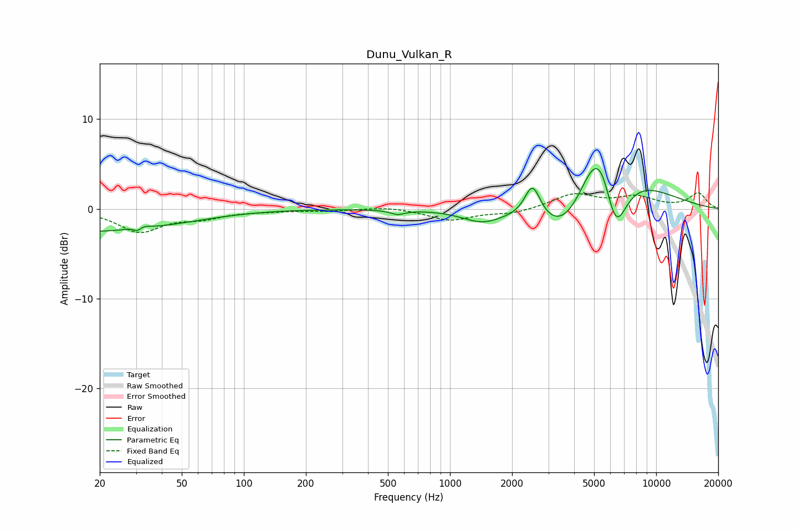

# Dunu_Vulkan_R
See [usage instructions](https://github.com/jaakkopasanen/AutoEq#usage) for more options and info.

### Parametric EQs
Apply preamp of -4.6 dB when using parametric equalizer.

|   # | Type    |   Fc (Hz) |    Q |   Gain (dB) |
|-----|---------|-----------|------|-------------|
|   1 | Peaking |        20 | 0.31 |        -3.1 |
|   2 | Peaking |        31 | 6    |        -2.1 |
|   3 | Peaking |        31 | 4.93 |         1.9 |
|   4 | Peaking |        32 | 0.28 |         0.6 |
|   5 | Peaking |       557 | 4.18 |        -0.5 |
|   6 | Peaking |      1433 | 1.45 |        -1.4 |
|   7 | Peaking |      2516 | 3.64 |         3.8 |
|   8 | Peaking |      3714 | 0.9  |        -8   |
|   9 | Peaking |      5359 | 0.99 |        15.5 |
|  10 | Peaking |      6319 | 2.02 |       -10.1 |

### Fixed Band EQs
When using fixed band (also called graphic) equalizer, apply preamp of **-1.9 dB** (if available) and set gains manually with these parameters.

|   # | Type    |   Fc (Hz) |    Q |   Gain (dB) |
|-----|---------|-----------|------|-------------|
|   1 | Peaking |        31 | 1.41 |        -2.5 |
|   2 | Peaking |        62 | 1.41 |        -0.8 |
|   3 | Peaking |       125 | 1.41 |        -0.2 |
|   4 | Peaking |       250 | 1.41 |        -0.2 |
|   5 | Peaking |       500 | 1.41 |         0.3 |
|   6 | Peaking |      1000 | 1.41 |        -1.2 |
|   7 | Peaking |      2000 | 1.41 |        -0.5 |
|   8 | Peaking |      4000 | 1.41 |         1.6 |
|   9 | Peaking |      8000 | 1.41 |         1.2 |
|  10 | Peaking |     16000 | 1.41 |         1.7 |

### Graphs

