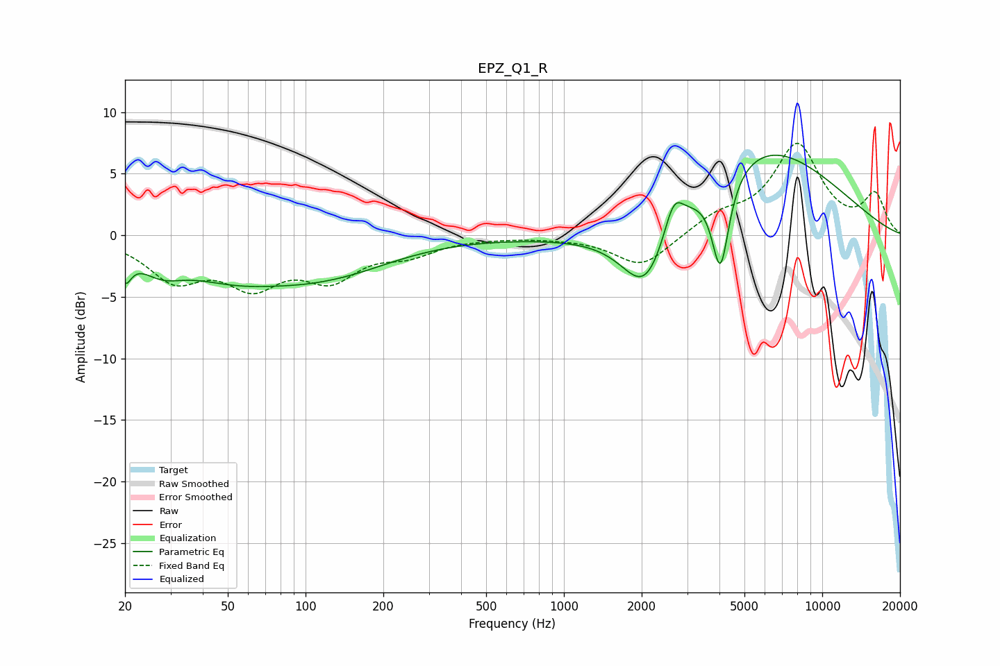

# EPZ_Q1_R
See [usage instructions](https://github.com/jaakkopasanen/AutoEq#usage) for more options and info.

### Parametric EQs
Apply preamp of -6.6 dB when using parametric equalizer.

|   # | Type    |   Fc (Hz) |    Q |   Gain (dB) |
|-----|---------|-----------|------|-------------|
|   1 | Peaking |        20 | 5.98 |        -2.1 |
|   2 | Peaking |        28 | 1.75 |        -1.5 |
|   3 | Peaking |        60 | 0.55 |        -3.6 |
|   4 | Peaking |        71 | 1.1  |         0.4 |
|   5 | Peaking |       141 | 0.62 |        -1.7 |
|   6 | Peaking |      1933 | 0.47 |        -1   |
|   7 | Peaking |      2076 | 1.5  |        -5.9 |
|   8 | Peaking |      2658 | 3.75 |         2.9 |
|   9 | Peaking |      4036 | 4.18 |        -7.6 |
|  10 | Peaking |      5650 | 0.45 |         7.6 |

### Fixed Band EQs
When using fixed band (also called graphic) equalizer, apply preamp of **-7.6 dB** (if available) and set gains manually with these parameters.

|   # | Type    |   Fc (Hz) |    Q |   Gain (dB) |
|-----|---------|-----------|------|-------------|
|   1 | Peaking |        31 | 1.41 |        -3.3 |
|   2 | Peaking |        62 | 1.41 |        -3.5 |
|   3 | Peaking |       125 | 1.41 |        -3.1 |
|   4 | Peaking |       250 | 1.41 |        -1.3 |
|   5 | Peaking |       500 | 1.41 |        -0.1 |
|   6 | Peaking |      1000 | 1.41 |        -0.1 |
|   7 | Peaking |      2000 | 1.41 |        -2.6 |
|   8 | Peaking |      4000 | 1.41 |         1.4 |
|   9 | Peaking |      8000 | 1.41 |         7.2 |
|  10 | Peaking |     16000 | 1.41 |         3.2 |

### Graphs

