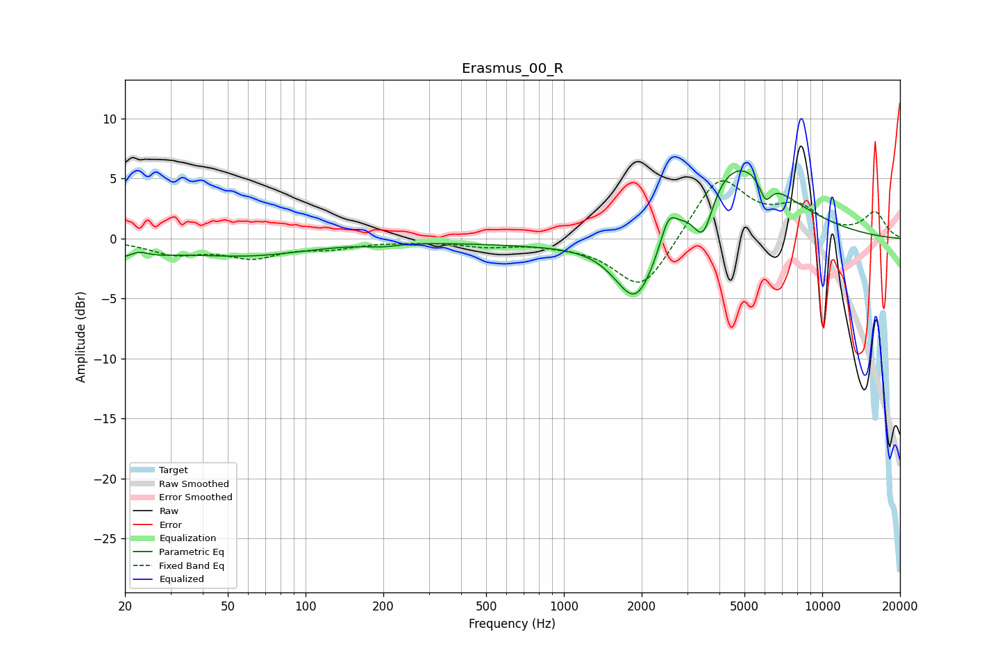

# Erasmus_00_R
See [usage instructions](https://github.com/jaakkopasanen/AutoEq#usage) for more options and info.

### Parametric EQs
Apply preamp of -5.7 dB when using parametric equalizer.

|   # | Type    |   Fc (Hz) |    Q |   Gain (dB) |
|-----|---------|-----------|------|-------------|
|   1 | Peaking |        20 | 1.18 |        -1.5 |
|   2 | Peaking |        23 | 3.53 |         0.7 |
|   3 | Peaking |        59 | 0.57 |        -1.3 |
|   4 | Peaking |       198 | 2.48 |        -0.2 |
|   5 | Peaking |      1386 | 0.31 |        -0.7 |
|   6 | Peaking |      1908 | 1.7  |        -6.1 |
|   7 | Peaking |      2539 | 4.81 |         2.1 |
|   8 | Peaking |      3464 | 3.62 |        -3.9 |
|   9 | Peaking |      4532 | 0.75 |         7.1 |
|  10 | Peaking |      6033 | 5.93 |        -1.8 |

### Fixed Band EQs
When using fixed band (also called graphic) equalizer, apply preamp of **-4.9 dB** (if available) and set gains manually with these parameters.

|   # | Type    |   Fc (Hz) |    Q |   Gain (dB) |
|-----|---------|-----------|------|-------------|
|   1 | Peaking |        31 | 1.41 |        -1.1 |
|   2 | Peaking |        62 | 1.41 |        -1.4 |
|   3 | Peaking |       125 | 1.41 |        -0.6 |
|   4 | Peaking |       250 | 1.41 |        -0.1 |
|   5 | Peaking |       500 | 1.41 |        -0.5 |
|   6 | Peaking |      1000 | 1.41 |        -0.3 |
|   7 | Peaking |      2000 | 1.41 |        -4.5 |
|   8 | Peaking |      4000 | 1.41 |         5.2 |
|   9 | Peaking |      8000 | 1.41 |         2.3 |
|  10 | Peaking |     16000 | 1.41 |         2.1 |

### Graphs

