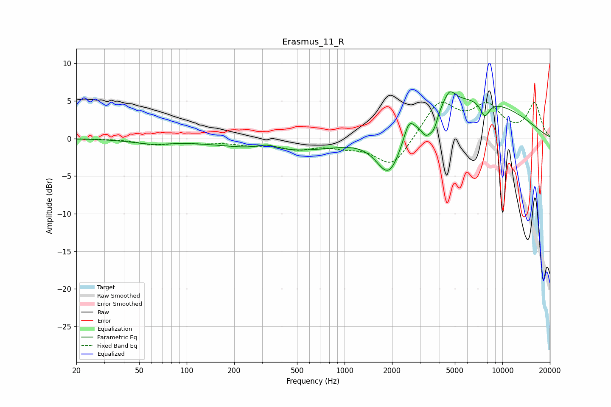

# Erasmus_11_R
See [usage instructions](https://github.com/jaakkopasanen/AutoEq#usage) for more options and info.

### Parametric EQs
Apply preamp of -6.3 dB when using parametric equalizer.

|   # | Type    |   Fc (Hz) |    Q |   Gain (dB) |
|-----|---------|-----------|------|-------------|
|   1 | Peaking |        60 | 1.12 |        -0.6 |
|   2 | Peaking |       324 | 2.23 |         0.7 |
|   3 | Peaking |       604 | 0.31 |        -2   |
|   4 | Peaking |      1919 | 1.62 |        -7   |
|   5 | Peaking |      2554 | 4.71 |         2   |
|   6 | Peaking |      3307 | 3.87 |        -2.7 |
|   7 | Peaking |      3695 | 6    |        -1.7 |
|   8 | Peaking |      4623 | 4.01 |         1.8 |
|   9 | Peaking |      5114 | 0.29 |         5.8 |
|  10 | Peaking |      7741 | 4.51 |        -2.1 |

### Fixed Band EQs
When using fixed band (also called graphic) equalizer, apply preamp of **-4.9 dB** (if available) and set gains manually with these parameters.

|   # | Type    |   Fc (Hz) |    Q |   Gain (dB) |
|-----|---------|-----------|------|-------------|
|   1 | Peaking |        31 | 1.41 |        -0   |
|   2 | Peaking |        62 | 1.41 |        -0.7 |
|   3 | Peaking |       125 | 1.41 |        -0.4 |
|   4 | Peaking |       250 | 1.41 |        -0.7 |
|   5 | Peaking |       500 | 1.41 |        -1.2 |
|   6 | Peaking |      1000 | 1.41 |        -0.8 |
|   7 | Peaking |      2000 | 1.41 |        -3.9 |
|   8 | Peaking |      4000 | 1.41 |         4.8 |
|   9 | Peaking |      8000 | 1.41 |         3.9 |
|  10 | Peaking |     16000 | 1.41 |         4.6 |

### Graphs

