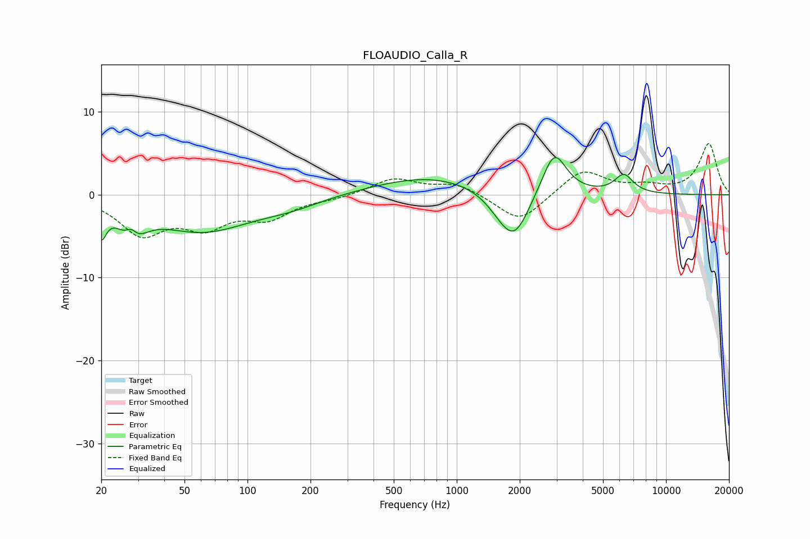

# FLOAUDIO_Calla_R
See [usage instructions](https://github.com/jaakkopasanen/AutoEq#usage) for more options and info.

### Parametric EQs
Apply preamp of -4.6 dB when using parametric equalizer.

|   # | Type    |   Fc (Hz) |    Q |   Gain (dB) |
|-----|---------|-----------|------|-------------|
|   1 | Peaking |        20 | 5.91 |        -3.4 |
|   2 | Peaking |        28 | 4.81 |         2.2 |
|   3 | Peaking |        28 | 2.51 |        -4.2 |
|   4 | Peaking |        61 | 0.61 |        -4.2 |
|   5 | Peaking |       161 | 0.94 |        -0.9 |
|   6 | Peaking |       748 | 0.53 |         2.3 |
|   7 | Peaking |      1654 | 1.88 |        -1.8 |
|   8 | Peaking |      1905 | 1.99 |        -4.8 |
|   9 | Peaking |      2923 | 2.43 |         5.4 |
|  10 | Peaking |      6289 | 3.12 |         2.2 |

### Fixed Band EQs
When using fixed band (also called graphic) equalizer, apply preamp of **-6.3 dB** (if available) and set gains manually with these parameters.

|   # | Type    |   Fc (Hz) |    Q |   Gain (dB) |
|-----|---------|-----------|------|-------------|
|   1 | Peaking |        31 | 1.41 |        -4.5 |
|   2 | Peaking |        62 | 1.41 |        -3.3 |
|   3 | Peaking |       125 | 1.41 |        -2.5 |
|   4 | Peaking |       250 | 1.41 |        -0.4 |
|   5 | Peaking |       500 | 1.41 |         1.9 |
|   6 | Peaking |      1000 | 1.41 |         1.3 |
|   7 | Peaking |      2000 | 1.41 |        -3.4 |
|   8 | Peaking |      4000 | 1.41 |         3.1 |
|   9 | Peaking |      8000 | 1.41 |         0.8 |
|  10 | Peaking |     16000 | 1.41 |         6.1 |

### Graphs

