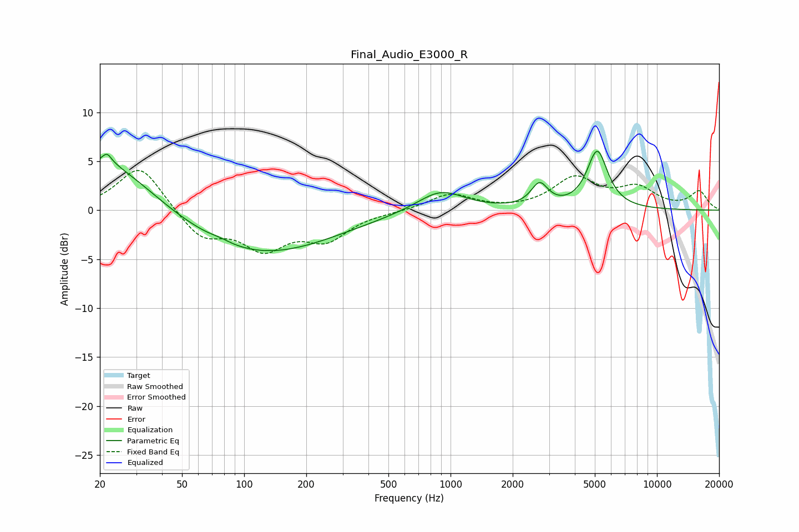

# Final_Audio_E3000_R
See [usage instructions](https://github.com/jaakkopasanen/AutoEq#usage) for more options and info.

### Parametric EQs
Apply preamp of -6.1 dB when using parametric equalizer.

|   # | Type    |   Fc (Hz) |    Q |   Gain (dB) |
|-----|---------|-----------|------|-------------|
|   1 | Peaking |        21 | 0.62 |         5.4 |
|   2 | Peaking |        22 | 5.52 |         3.2 |
|   3 | Peaking |        22 | 5.93 |        -2.1 |
|   4 | Peaking |        77 | 3.01 |         0.2 |
|   5 | Peaking |       117 | 0.39 |        -4.6 |
|   6 | Peaking |       722 | 2.39 |        -0   |
|   7 | Peaking |       736 | 2.08 |        -0.1 |
|   8 | Peaking |       889 | 1.21 |         2.2 |
|   9 | Peaking |      2698 | 3.47 |         2.3 |
|  10 | Peaking |      5139 | 2.81 |         5.9 |

### Fixed Band EQs
When using fixed band (also called graphic) equalizer, apply preamp of **-4.2 dB** (if available) and set gains manually with these parameters.

|   # | Type    |   Fc (Hz) |    Q |   Gain (dB) |
|-----|---------|-----------|------|-------------|
|   1 | Peaking |        31 | 1.41 |         4.7 |
|   2 | Peaking |        62 | 1.41 |        -2.8 |
|   3 | Peaking |       125 | 1.41 |        -3.6 |
|   4 | Peaking |       250 | 1.41 |        -2.7 |
|   5 | Peaking |       500 | 1.41 |        -0.1 |
|   6 | Peaking |      1000 | 1.41 |         1.7 |
|   7 | Peaking |      2000 | 1.41 |        -0.1 |
|   8 | Peaking |      4000 | 1.41 |         3.2 |
|   9 | Peaking |      8000 | 1.41 |         2.1 |
|  10 | Peaking |     16000 | 1.41 |         1.9 |

### Graphs

