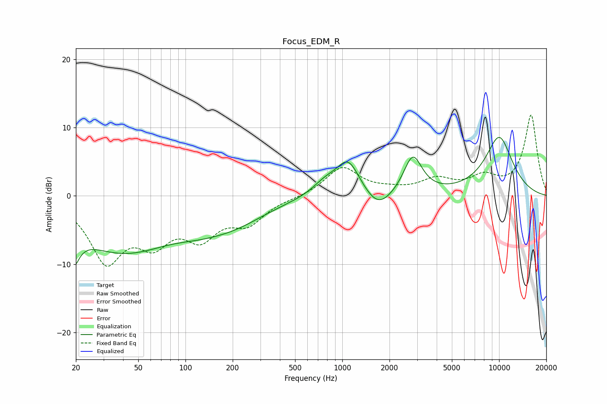

# Focus_EDM_R
See [usage instructions](https://github.com/jaakkopasanen/AutoEq#usage) for more options and info.

### Parametric EQs
Apply preamp of -8.7 dB when using parametric equalizer.

|   # | Type    |   Fc (Hz) |    Q |   Gain (dB) |
|-----|---------|-----------|------|-------------|
|   1 | Peaking |        20 | 4.76 |        -7.5 |
|   2 | Peaking |        20 | 5.59 |         3.5 |
|   3 | Peaking |        39 | 0.41 |        -7.9 |
|   4 | Peaking |       123 | 0.97 |        -1   |
|   5 | Peaking |       203 | 0.67 |        -3   |
|   6 | Peaking |       778 | 1.69 |         1.8 |
|   7 | Peaking |      1092 | 1.88 |         5.1 |
|   8 | Peaking |      1696 | 1.62 |        -2.8 |
|   9 | Peaking |      2817 | 2.39 |         5.7 |
|  10 | Peaking |     10000 | 1.31 |         8.5 |

### Fixed Band EQs
When using fixed band (also called graphic) equalizer, apply preamp of **-11.9 dB** (if available) and set gains manually with these parameters.

|   # | Type    |   Fc (Hz) |    Q |   Gain (dB) |
|-----|---------|-----------|------|-------------|
|   1 | Peaking |        31 | 1.41 |        -9   |
|   2 | Peaking |        62 | 1.41 |        -5.5 |
|   3 | Peaking |       125 | 1.41 |        -5.2 |
|   4 | Peaking |       250 | 1.41 |        -3.5 |
|   5 | Peaking |       500 | 1.41 |        -0.2 |
|   6 | Peaking |      1000 | 1.41 |         4.2 |
|   7 | Peaking |      2000 | 1.41 |         0.5 |
|   8 | Peaking |      4000 | 1.41 |         2.1 |
|   9 | Peaking |      8000 | 1.41 |         2.4 |
|  10 | Peaking |     16000 | 1.41 |        11.8 |

### Graphs

