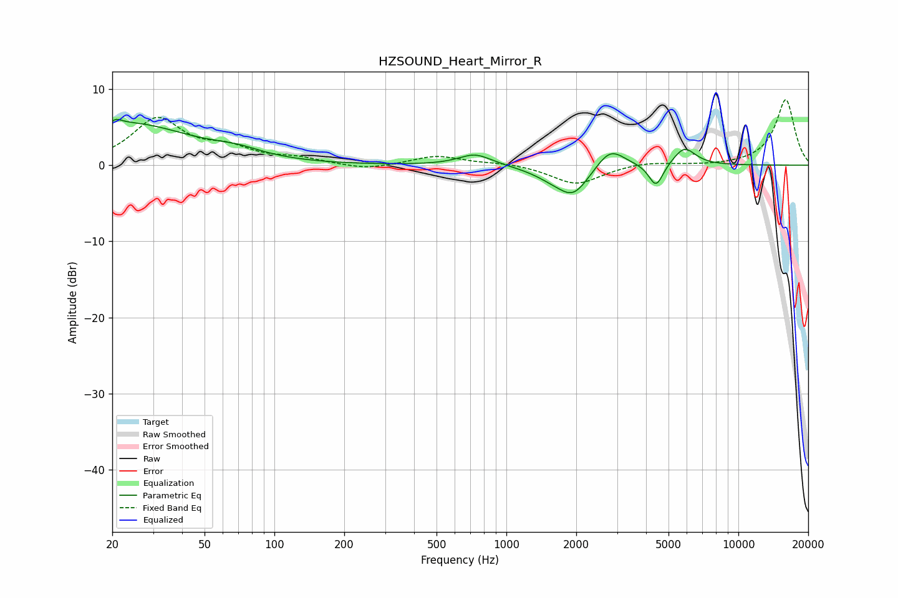

# HZSOUND_Heart_Mirror_R
See [usage instructions](https://github.com/jaakkopasanen/AutoEq#usage) for more options and info.

### Parametric EQs
Apply preamp of -6.1 dB when using parametric equalizer.

|   # | Type    |   Fc (Hz) |    Q |   Gain (dB) |
|-----|---------|-----------|------|-------------|
|   1 | Peaking |        20 | 5.96 |        -2.8 |
|   2 | Peaking |        20 | 5.75 |         3.3 |
|   3 | Peaking |        23 | 0.52 |         5.4 |
|   4 | Peaking |        69 | 1.32 |         0.9 |
|   5 | Peaking |       733 | 1.99 |         1.5 |
|   6 | Peaking |      1571 | 1.62 |        -1.1 |
|   7 | Peaking |      1948 | 2.09 |        -3.5 |
|   8 | Peaking |      2803 | 2.34 |         2.7 |
|   9 | Peaking |      4416 | 4.49 |        -3.1 |
|  10 | Peaking |      5852 | 2.86 |         2.4 |

### Fixed Band EQs
When using fixed band (also called graphic) equalizer, apply preamp of **-8.7 dB** (if available) and set gains manually with these parameters.

|   # | Type    |   Fc (Hz) |    Q |   Gain (dB) |
|-----|---------|-----------|------|-------------|
|   1 | Peaking |        31 | 1.41 |         5.9 |
|   2 | Peaking |        62 | 1.41 |         1.8 |
|   3 | Peaking |       125 | 1.41 |         0.8 |
|   4 | Peaking |       250 | 1.41 |        -0.7 |
|   5 | Peaking |       500 | 1.41 |         1.2 |
|   6 | Peaking |      1000 | 1.41 |         0.3 |
|   7 | Peaking |      2000 | 1.41 |        -2.5 |
|   8 | Peaking |      4000 | 1.41 |         0.5 |
|   9 | Peaking |      8000 | 1.41 |        -0.1 |
|  10 | Peaking |     16000 | 1.41 |         8.7 |

### Graphs

