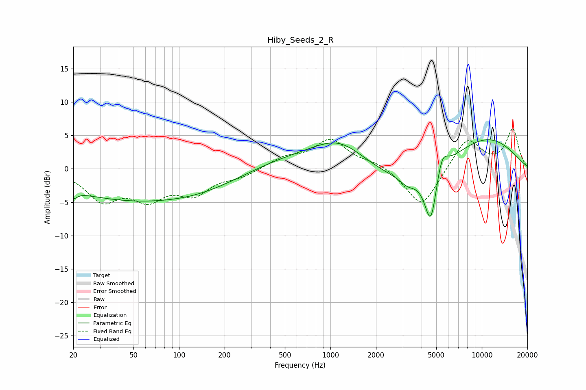

# Hiby_Seeds_2_R
See [usage instructions](https://github.com/jaakkopasanen/AutoEq#usage) for more options and info.

### Parametric EQs
Apply preamp of -4.4 dB when using parametric equalizer.

|   # | Type    |   Fc (Hz) |    Q |   Gain (dB) |
|-----|---------|-----------|------|-------------|
|   1 | Peaking |        20 | 5.61 |        -1.1 |
|   2 | Peaking |        46 | 0.31 |        -4.4 |
|   3 | Peaking |       159 | 0.51 |        -1.6 |
|   4 | Peaking |       494 | 0.51 |         1.5 |
|   5 | Peaking |      1156 | 0.77 |         4.4 |
|   6 | Peaking |      3237 | 0.42 |        -3   |
|   7 | Peaking |      3238 | 2.73 |        -1.2 |
|   8 | Peaking |      4604 | 3.37 |        -8.4 |
|   9 | Peaking |      5442 | 3.66 |         3.4 |
|  10 | Peaking |     10000 | 0.47 |         5.2 |

### Fixed Band EQs
When using fixed band (also called graphic) equalizer, apply preamp of **-6.1 dB** (if available) and set gains manually with these parameters.

|   # | Type    |   Fc (Hz) |    Q |   Gain (dB) |
|-----|---------|-----------|------|-------------|
|   1 | Peaking |        31 | 1.41 |        -4.4 |
|   2 | Peaking |        62 | 1.41 |        -3.9 |
|   3 | Peaking |       125 | 1.41 |        -3.4 |
|   4 | Peaking |       250 | 1.41 |        -1.1 |
|   5 | Peaking |       500 | 1.41 |         1.5 |
|   6 | Peaking |      1000 | 1.41 |         4.2 |
|   7 | Peaking |      2000 | 1.41 |         0.9 |
|   8 | Peaking |      4000 | 1.41 |        -5.9 |
|   9 | Peaking |      8000 | 1.41 |         4.7 |
|  10 | Peaking |     16000 | 1.41 |         5.8 |

### Graphs

