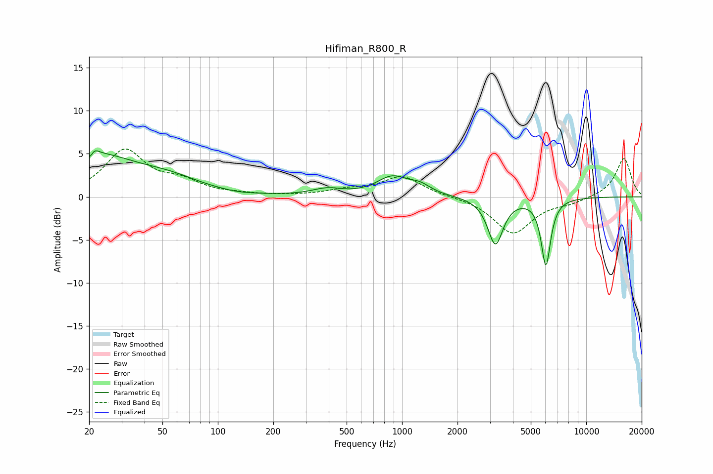

# Hifiman_R800_R
See [usage instructions](https://github.com/jaakkopasanen/AutoEq#usage) for more options and info.

### Parametric EQs
Apply preamp of -5.4 dB when using parametric equalizer.

|   # | Type    |   Fc (Hz) |    Q |   Gain (dB) |
|-----|---------|-----------|------|-------------|
|   1 | Peaking |        21 | 5.99 |        -3.1 |
|   2 | Peaking |        21 | 0.6  |         4.8 |
|   3 | Peaking |        21 | 5.99 |         3.1 |
|   4 | Peaking |        55 | 0.84 |         1.3 |
|   5 | Peaking |       129 | 1.74 |        -0.2 |
|   6 | Peaking |       392 | 1.74 |         0.8 |
|   7 | Peaking |       884 | 1.68 |         2.2 |
|   8 | Peaking |      1249 | 2.38 |         0.9 |
|   9 | Peaking |      3211 | 3.43 |        -5.5 |
|  10 | Peaking |      6038 | 5.43 |        -7.8 |

### Fixed Band EQs
When using fixed band (also called graphic) equalizer, apply preamp of **-5.7 dB** (if available) and set gains manually with these parameters.

|   # | Type    |   Fc (Hz) |    Q |   Gain (dB) |
|-----|---------|-----------|------|-------------|
|   1 | Peaking |        31 | 1.41 |         5.3 |
|   2 | Peaking |        62 | 1.41 |         1.5 |
|   3 | Peaking |       125 | 1.41 |         0.2 |
|   4 | Peaking |       250 | 1.41 |         0.1 |
|   5 | Peaking |       500 | 1.41 |         0.7 |
|   6 | Peaking |      1000 | 1.41 |         2.3 |
|   7 | Peaking |      2000 | 1.41 |         0   |
|   8 | Peaking |      4000 | 1.41 |        -4.2 |
|   9 | Peaking |      8000 | 1.41 |        -0.6 |
|  10 | Peaking |     16000 | 1.41 |         4.5 |

### Graphs

