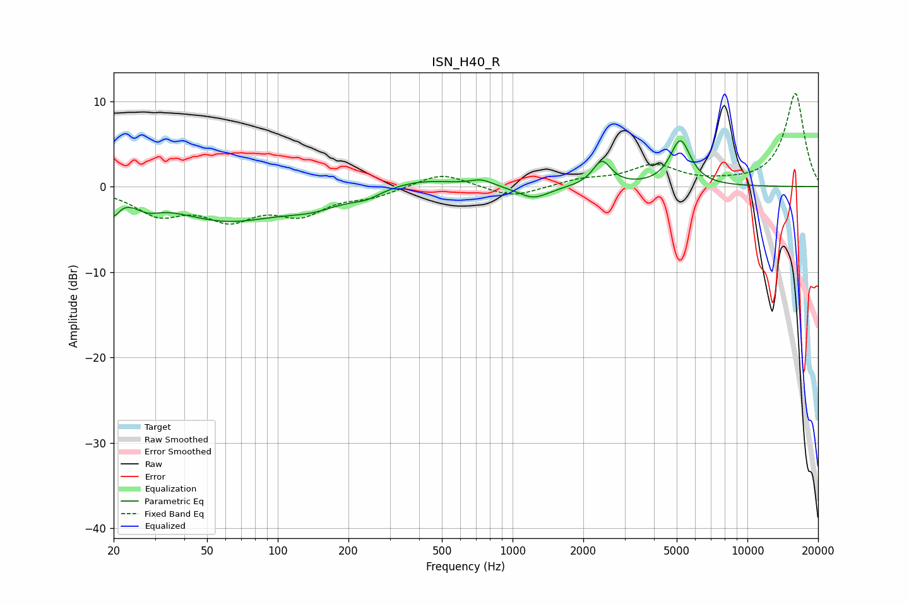

# ISN_H40_R
See [usage instructions](https://github.com/jaakkopasanen/AutoEq#usage) for more options and info.

### Parametric EQs
Apply preamp of -5.5 dB when using parametric equalizer.

|   # | Type    |   Fc (Hz) |    Q |   Gain (dB) |
|-----|---------|-----------|------|-------------|
|   1 | Peaking |        20 | 5.99 |        -2.1 |
|   2 | Peaking |        28 | 2.67 |        -1.1 |
|   3 | Peaking |        60 | 0.62 |        -3.7 |
|   4 | Peaking |       142 | 1.07 |        -1.5 |
|   5 | Peaking |       238 | 2.37 |        -0.8 |
|   6 | Peaking |       403 | 0.99 |         1   |
|   7 | Peaking |       737 | 2.9  |         0.7 |
|   8 | Peaking |      1228 | 2.1  |        -1.5 |
|   9 | Peaking |      2401 | 3.66 |         2.9 |
|  10 | Peaking |      5181 | 3.2  |         5.3 |

### Fixed Band EQs
When using fixed band (also called graphic) equalizer, apply preamp of **-11.0 dB** (if available) and set gains manually with these parameters.

|   # | Type    |   Fc (Hz) |    Q |   Gain (dB) |
|-----|---------|-----------|------|-------------|
|   1 | Peaking |        31 | 1.41 |        -3   |
|   2 | Peaking |        62 | 1.41 |        -3.3 |
|   3 | Peaking |       125 | 1.41 |        -2.9 |
|   4 | Peaking |       250 | 1.41 |        -1   |
|   5 | Peaking |       500 | 1.41 |         1.7 |
|   6 | Peaking |      1000 | 1.41 |        -1.3 |
|   7 | Peaking |      2000 | 1.41 |         0.8 |
|   8 | Peaking |      4000 | 1.41 |         2.4 |
|   9 | Peaking |      8000 | 1.41 |         0.3 |
|  10 | Peaking |     16000 | 1.41 |        10.9 |

### Graphs

