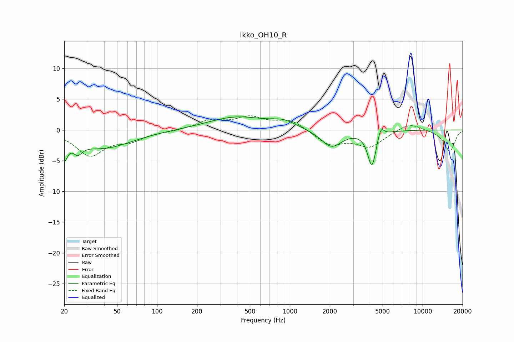

# Ikko_OH10_R
See [usage instructions](https://github.com/jaakkopasanen/AutoEq#usage) for more options and info.

### Parametric EQs
Apply preamp of -2.2 dB when using parametric equalizer.

|   # | Type    |   Fc (Hz) |    Q |   Gain (dB) |
|-----|---------|-----------|------|-------------|
|   1 | Peaking |        20 | 5.86 |        -3.2 |
|   2 | Peaking |        25 | 4.31 |        -1.7 |
|   3 | Peaking |        39 | 0.65 |        -2.9 |
|   4 | Peaking |        55 | 5.97 |         2.5 |
|   5 | Peaking |        55 | 5.94 |        -2.4 |
|   6 | Peaking |       397 | 0.66 |         2.1 |
|   7 | Peaking |       899 | 1.52 |         1.1 |
|   8 | Peaking |      2057 | 1.78 |        -2.8 |
|   9 | Peaking |      4153 | 4.4  |        -5.8 |
|  10 | Peaking |      4834 | 5.95 |         1.9 |

### Fixed Band EQs
When using fixed band (also called graphic) equalizer, apply preamp of **-2.4 dB** (if available) and set gains manually with these parameters.

|   # | Type    |   Fc (Hz) |    Q |   Gain (dB) |
|-----|---------|-----------|------|-------------|
|   1 | Peaking |        31 | 1.41 |        -4   |
|   2 | Peaking |        62 | 1.41 |        -1.5 |
|   3 | Peaking |       125 | 1.41 |        -0.2 |
|   4 | Peaking |       250 | 1.41 |         1.4 |
|   5 | Peaking |       500 | 1.41 |         1.9 |
|   6 | Peaking |      1000 | 1.41 |         1.6 |
|   7 | Peaking |      2000 | 1.41 |        -2.4 |
|   8 | Peaking |      4000 | 1.41 |        -2.6 |
|   9 | Peaking |      8000 | 1.41 |         1.3 |
|  10 | Peaking |     16000 | 1.41 |        -3.5 |

### Graphs

