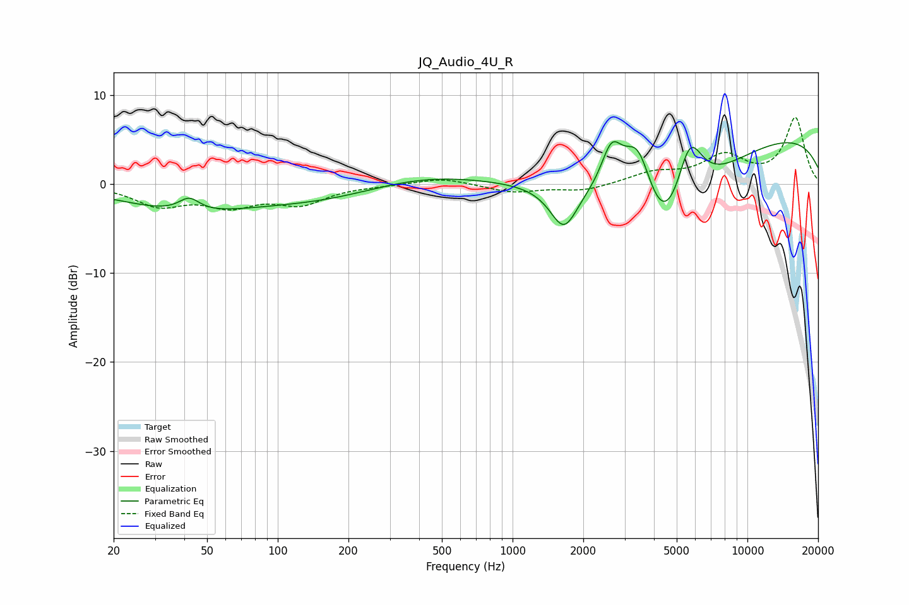

# JQ_Audio_4U_R
See [usage instructions](https://github.com/jaakkopasanen/AutoEq#usage) for more options and info.

### Parametric EQs
Apply preamp of -4.9 dB when using parametric equalizer.

|   # | Type    |   Fc (Hz) |    Q |   Gain (dB) |
|-----|---------|-----------|------|-------------|
|   1 | Peaking |        40 | 0.52 |        -2.8 |
|   2 | Peaking |        42 | 3.26 |         1.5 |
|   3 | Peaking |       180 | 0.45 |        -2.1 |
|   4 | Peaking |       365 | 0.51 |         1.9 |
|   5 | Peaking |      1654 | 2.43 |        -4.8 |
|   6 | Peaking |      2639 | 3.15 |         4.8 |
|   7 | Peaking |      3423 | 1.99 |         8.6 |
|   8 | Peaking |      4415 | 0.83 |       -14.4 |
|   9 | Peaking |      5666 | 2.26 |         8.1 |
|  10 | Peaking |     10000 | 0.2  |         6   |

### Fixed Band EQs
When using fixed band (also called graphic) equalizer, apply preamp of **-7.6 dB** (if available) and set gains manually with these parameters.

|   # | Type    |   Fc (Hz) |    Q |   Gain (dB) |
|-----|---------|-----------|------|-------------|
|   1 | Peaking |        31 | 1.41 |        -2.2 |
|   2 | Peaking |        62 | 1.41 |        -2.1 |
|   3 | Peaking |       125 | 1.41 |        -2   |
|   4 | Peaking |       250 | 1.41 |        -0.1 |
|   5 | Peaking |       500 | 1.41 |         0.7 |
|   6 | Peaking |      1000 | 1.41 |        -0.9 |
|   7 | Peaking |      2000 | 1.41 |        -0.8 |
|   8 | Peaking |      4000 | 1.41 |         1.2 |
|   9 | Peaking |      8000 | 1.41 |         3   |
|  10 | Peaking |     16000 | 1.41 |         7.4 |

### Graphs

