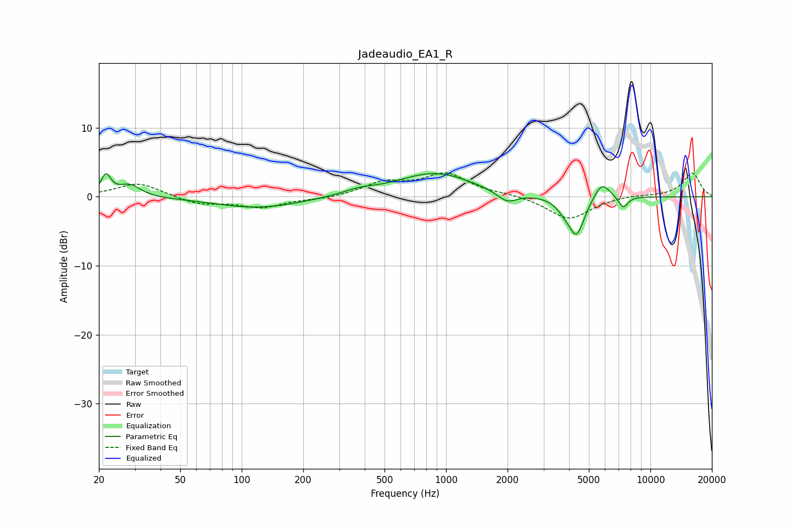

# Jadeaudio_EA1_R
See [usage instructions](https://github.com/jaakkopasanen/AutoEq#usage) for more options and info.

### Parametric EQs
Apply preamp of -3.5 dB when using parametric equalizer.

|   # | Type    |   Fc (Hz) |    Q |   Gain (dB) |
|-----|---------|-----------|------|-------------|
|   1 | Peaking |        22 | 5.98 |         2.9 |
|   2 | Peaking |        28 | 2.66 |         1.7 |
|   3 | Peaking |       121 | 0.67 |        -1.6 |
|   4 | Peaking |       375 | 1.76 |         0.7 |
|   5 | Peaking |       881 | 0.77 |         3.5 |
|   6 | Peaking |      1991 | 2.84 |        -1.6 |
|   7 | Peaking |      3783 | 3.79 |        -1   |
|   8 | Peaking |      4352 | 3.58 |        -5.5 |
|   9 | Peaking |      5785 | 3.58 |         2.5 |
|  10 | Peaking |      7366 | 6    |        -1.7 |

### Fixed Band EQs
When using fixed band (also called graphic) equalizer, apply preamp of **-3.6 dB** (if available) and set gains manually with these parameters.

|   # | Type    |   Fc (Hz) |    Q |   Gain (dB) |
|-----|---------|-----------|------|-------------|
|   1 | Peaking |        31 | 1.41 |         2.1 |
|   2 | Peaking |        62 | 1.41 |        -1.1 |
|   3 | Peaking |       125 | 1.41 |        -1.5 |
|   4 | Peaking |       250 | 1.41 |        -0.3 |
|   5 | Peaking |       500 | 1.41 |         1.9 |
|   6 | Peaking |      1000 | 1.41 |         3.2 |
|   7 | Peaking |      2000 | 1.41 |         0.3 |
|   8 | Peaking |      4000 | 1.41 |        -3.3 |
|   9 | Peaking |      8000 | 1.41 |         0.3 |
|  10 | Peaking |     16000 | 1.41 |         3.5 |

### Graphs

