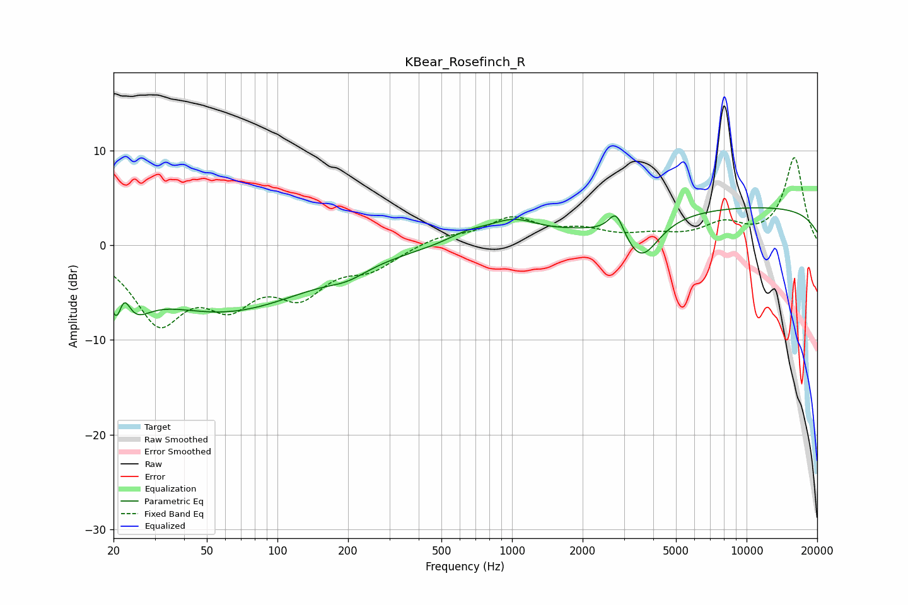

# KBear_Rosefinch_R
See [usage instructions](https://github.com/jaakkopasanen/AutoEq#usage) for more options and info.

### Parametric EQs
Apply preamp of -4.1 dB when using parametric equalizer.

|   # | Type    |   Fc (Hz) |    Q |   Gain (dB) |
|-----|---------|-----------|------|-------------|
|   1 | Peaking |        21 | 5.57 |        -3.9 |
|   2 | Peaking |        22 | 4.66 |         4   |
|   3 | Peaking |        24 | 2.06 |        -3.8 |
|   4 | Peaking |        59 | 0.37 |        -6.8 |
|   5 | Peaking |       199 | 1.7  |        -0.9 |
|   6 | Peaking |       647 | 1.58 |         1   |
|   7 | Peaking |      1008 | 1.34 |         2   |
|   8 | Peaking |      2781 | 4.35 |         2.6 |
|   9 | Peaking |      3548 | 1.87 |        -4.4 |
|  10 | Peaking |     10000 | 0.18 |         4.1 |

### Fixed Band EQs
When using fixed band (also called graphic) equalizer, apply preamp of **-9.4 dB** (if available) and set gains manually with these parameters.

|   # | Type    |   Fc (Hz) |    Q |   Gain (dB) |
|-----|---------|-----------|------|-------------|
|   1 | Peaking |        31 | 1.41 |        -7.6 |
|   2 | Peaking |        62 | 1.41 |        -5   |
|   3 | Peaking |       125 | 1.41 |        -4.5 |
|   4 | Peaking |       250 | 1.41 |        -2.1 |
|   5 | Peaking |       500 | 1.41 |         0.9 |
|   6 | Peaking |      1000 | 1.41 |         2.7 |
|   7 | Peaking |      2000 | 1.41 |         1.3 |
|   8 | Peaking |      4000 | 1.41 |         0.8 |
|   9 | Peaking |      8000 | 1.41 |         2   |
|  10 | Peaking |     16000 | 1.41 |         9.2 |

### Graphs

