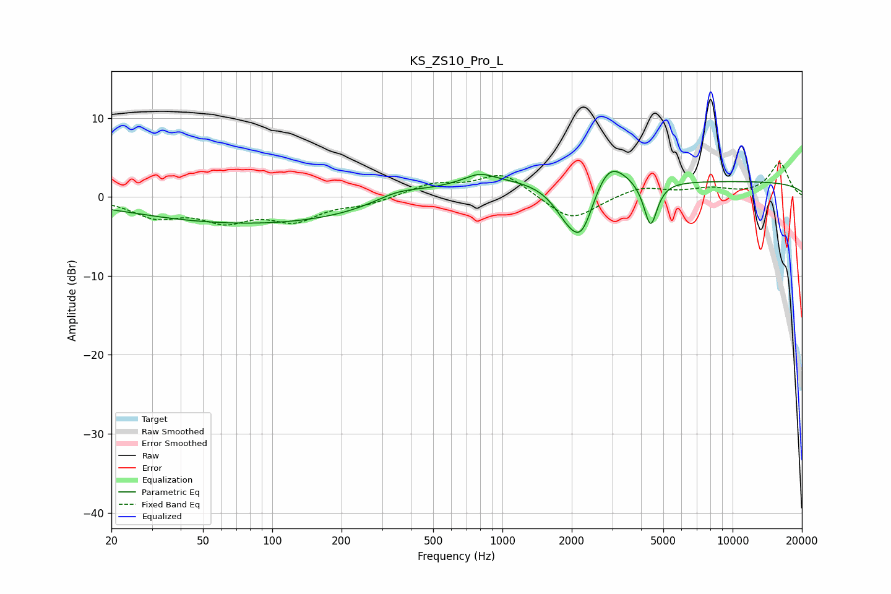

# KS_ZS10_Pro_L
See [usage instructions](https://github.com/jaakkopasanen/AutoEq#usage) for more options and info.

### Parametric EQs
Apply preamp of -3.3 dB when using parametric equalizer.

|   # | Type    |   Fc (Hz) |    Q |   Gain (dB) |
|-----|---------|-----------|------|-------------|
|   1 | Peaking |       109 | 0.21 |        -3.6 |
|   2 | Peaking |       348 | 1.4  |         1.1 |
|   3 | Peaking |       565 | 0.68 |        -0.6 |
|   4 | Peaking |       678 | 0.43 |         3.4 |
|   5 | Peaking |       794 | 2.41 |         1   |
|   6 | Peaking |      1903 | 2.21 |        -2.6 |
|   7 | Peaking |      2211 | 2.45 |        -6.3 |
|   8 | Peaking |      2883 | 1.92 |         4   |
|   9 | Peaking |      4401 | 4.86 |        -5.8 |
|  10 | Peaking |     10000 | 0.18 |         1.9 |

### Fixed Band EQs
When using fixed band (also called graphic) equalizer, apply preamp of **-4.4 dB** (if available) and set gains manually with these parameters.

|   # | Type    |   Fc (Hz) |    Q |   Gain (dB) |
|-----|---------|-----------|------|-------------|
|   1 | Peaking |        31 | 1.41 |        -2.3 |
|   2 | Peaking |        62 | 1.41 |        -2.6 |
|   3 | Peaking |       125 | 1.41 |        -2.7 |
|   4 | Peaking |       250 | 1.41 |        -0.8 |
|   5 | Peaking |       500 | 1.41 |         1.5 |
|   6 | Peaking |      1000 | 1.41 |         3   |
|   7 | Peaking |      2000 | 1.41 |        -3.2 |
|   8 | Peaking |      4000 | 1.41 |         1.3 |
|   9 | Peaking |      8000 | 1.41 |         0.9 |
|  10 | Peaking |     16000 | 1.41 |         4.3 |

### Graphs

