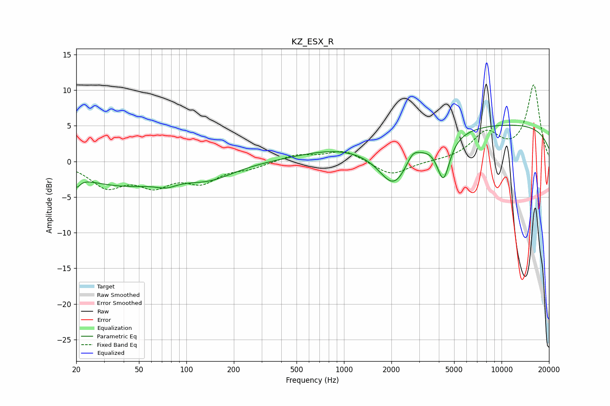

# KZ_ESX_R
See [usage instructions](https://github.com/jaakkopasanen/AutoEq#usage) for more options and info.

### Parametric EQs
Apply preamp of -5.2 dB when using parametric equalizer.

|   # | Type    |   Fc (Hz) |    Q |   Gain (dB) |
|-----|---------|-----------|------|-------------|
|   1 | Peaking |        20 | 5.97 |        -1.4 |
|   2 | Peaking |        39 | 0.49 |        -3.2 |
|   3 | Peaking |        71 | 2.4  |         0.4 |
|   4 | Peaking |        73 | 2.19 |        -1.3 |
|   5 | Peaking |       141 | 0.89 |        -1.9 |
|   6 | Peaking |       870 | 0.58 |         1.4 |
|   7 | Peaking |      2079 | 1.44 |        -5.9 |
|   8 | Peaking |      2727 | 3.73 |         1.4 |
|   9 | Peaking |      4277 | 3.43 |        -6   |
|  10 | Peaking |     10000 | 0.18 |         5.2 |

### Fixed Band EQs
When using fixed band (also called graphic) equalizer, apply preamp of **-10.8 dB** (if available) and set gains manually with these parameters.

|   # | Type    |   Fc (Hz) |    Q |   Gain (dB) |
|-----|---------|-----------|------|-------------|
|   1 | Peaking |        31 | 1.41 |        -3.3 |
|   2 | Peaking |        62 | 1.41 |        -2.9 |
|   3 | Peaking |       125 | 1.41 |        -2.6 |
|   4 | Peaking |       250 | 1.41 |        -0.8 |
|   5 | Peaking |       500 | 1.41 |         0.9 |
|   6 | Peaking |      1000 | 1.41 |         1.6 |
|   7 | Peaking |      2000 | 1.41 |        -2   |
|   8 | Peaking |      4000 | 1.41 |        -0   |
|   9 | Peaking |      8000 | 1.41 |         3.8 |
|  10 | Peaking |     16000 | 1.41 |        10.6 |

### Graphs

