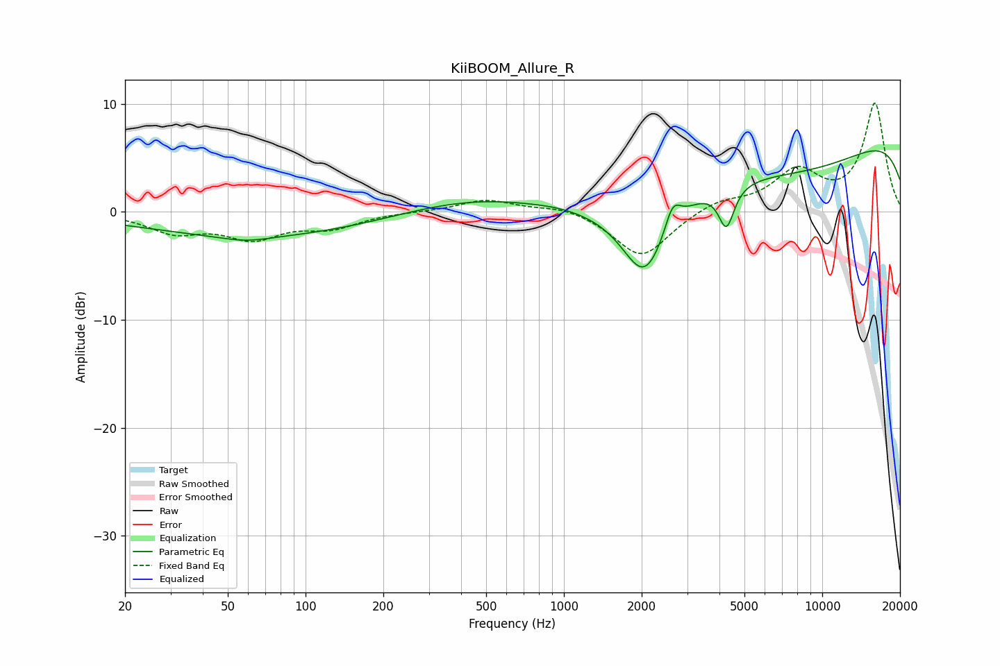

# KiiBOOM_Allure_R
See [usage instructions](https://github.com/jaakkopasanen/AutoEq#usage) for more options and info.

### Parametric EQs
Apply preamp of -5.8 dB when using parametric equalizer.

|   # | Type    |   Fc (Hz) |    Q |   Gain (dB) |
|-----|---------|-----------|------|-------------|
|   1 | Peaking |        59 | 1.52 |        -0.5 |
|   2 | Peaking |        95 | 0.22 |        -2.5 |
|   3 | Peaking |       952 | 1.62 |         0.1 |
|   4 | Peaking |      1289 | 0.2  |         6.7 |
|   5 | Peaking |      2058 | 1.56 |        -7.4 |
|   6 | Peaking |      2636 | 4.69 |         2.4 |
|   7 | Peaking |      3132 | 0.18 |        -8   |
|   8 | Peaking |      4256 | 4.74 |        -3.8 |
|   9 | Peaking |      4658 | 0.18 |        -1.1 |
|  10 | Peaking |     10000 | 0.18 |         9.4 |

### Fixed Band EQs
When using fixed band (also called graphic) equalizer, apply preamp of **-10.2 dB** (if available) and set gains manually with these parameters.

|   # | Type    |   Fc (Hz) |    Q |   Gain (dB) |
|-----|---------|-----------|------|-------------|
|   1 | Peaking |        31 | 1.41 |        -1.7 |
|   2 | Peaking |        62 | 1.41 |        -2.2 |
|   3 | Peaking |       125 | 1.41 |        -1.3 |
|   4 | Peaking |       250 | 1.41 |         0   |
|   5 | Peaking |       500 | 1.41 |         1.1 |
|   6 | Peaking |      1000 | 1.41 |         0.6 |
|   7 | Peaking |      2000 | 1.41 |        -4.3 |
|   8 | Peaking |      4000 | 1.41 |         1   |
|   9 | Peaking |      8000 | 1.41 |         3.6 |
|  10 | Peaking |     16000 | 1.41 |        10   |

### Graphs

