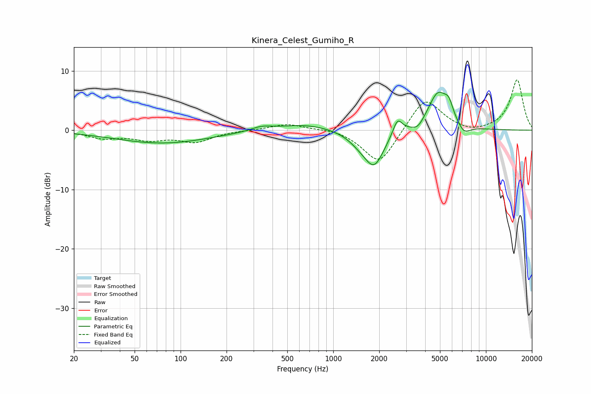

# Kinera_Celest_Gumiho_R
See [usage instructions](https://github.com/jaakkopasanen/AutoEq#usage) for more options and info.

### Parametric EQs
Apply preamp of -6.5 dB when using parametric equalizer.

|   # | Type    |   Fc (Hz) |    Q |   Gain (dB) |
|-----|---------|-----------|------|-------------|
|   1 | Peaking |        76 | 0.46 |        -2.2 |
|   2 | Peaking |       339 | 2.05 |         0.7 |
|   3 | Peaking |       656 | 0.81 |         1.1 |
|   4 | Peaking |      1491 | 1.83 |        -1.3 |
|   5 | Peaking |      1855 | 2.14 |        -5.6 |
|   6 | Peaking |      2637 | 4.6  |         2.7 |
|   7 | Peaking |      3588 | 3.74 |        -1.2 |
|   8 | Peaking |      4856 | 2.09 |         6.3 |
|   9 | Peaking |      5715 | 4.87 |         2.2 |
|  10 | Peaking |      7184 | 3.27 |        -1.6 |

### Fixed Band EQs
When using fixed band (also called graphic) equalizer, apply preamp of **-8.6 dB** (if available) and set gains manually with these parameters.

|   # | Type    |   Fc (Hz) |    Q |   Gain (dB) |
|-----|---------|-----------|------|-------------|
|   1 | Peaking |        31 | 1.41 |        -1.2 |
|   2 | Peaking |        62 | 1.41 |        -1.4 |
|   3 | Peaking |       125 | 1.41 |        -1.8 |
|   4 | Peaking |       250 | 1.41 |         0   |
|   5 | Peaking |       500 | 1.41 |         1.1 |
|   6 | Peaking |      1000 | 1.41 |         0.4 |
|   7 | Peaking |      2000 | 1.41 |        -6   |
|   8 | Peaking |      4000 | 1.41 |         5.7 |
|   9 | Peaking |      8000 | 1.41 |        -0.7 |
|  10 | Peaking |     16000 | 1.41 |         8.5 |

### Graphs

