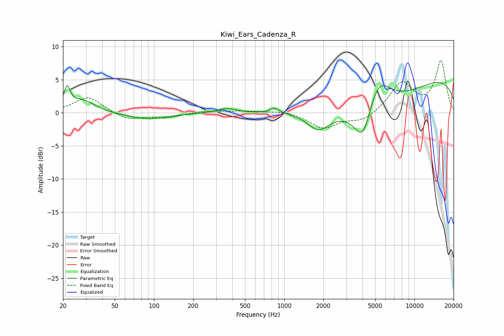

# Kiwi_Ears_Cadenza_R
See [usage instructions](https://github.com/jaakkopasanen/AutoEq#usage) for more options and info.

### Parametric EQs
Apply preamp of -4.7 dB when using parametric equalizer.

|   # | Type    |   Fc (Hz) |    Q |   Gain (dB) |
|-----|---------|-----------|------|-------------|
|   1 | Peaking |        21 | 6    |         3   |
|   2 | Peaking |        28 | 1.47 |         1.9 |
|   3 | Peaking |        88 | 0.91 |        -1   |
|   4 | Peaking |       362 | 2    |         0.7 |
|   5 | Peaking |       847 | 3.87 |         0.8 |
|   6 | Peaking |      1833 | 1.72 |        -2.7 |
|   7 | Peaking |      4031 | 2.08 |        -5.9 |
|   8 | Peaking |      4944 | 0.41 |        -4.9 |
|   9 | Peaking |      5233 | 1.45 |         5.5 |
|  10 | Peaking |     10000 | 0.18 |         6.1 |

### Fixed Band EQs
When using fixed band (also called graphic) equalizer, apply preamp of **-8.0 dB** (if available) and set gains manually with these parameters.

|   # | Type    |   Fc (Hz) |    Q |   Gain (dB) |
|-----|---------|-----------|------|-------------|
|   1 | Peaking |        31 | 1.41 |         2.5 |
|   2 | Peaking |        62 | 1.41 |        -1.1 |
|   3 | Peaking |       125 | 1.41 |        -0.7 |
|   4 | Peaking |       250 | 1.41 |         0.3 |
|   5 | Peaking |       500 | 1.41 |         0.3 |
|   6 | Peaking |      1000 | 1.41 |         0.4 |
|   7 | Peaking |      2000 | 1.41 |        -2.3 |
|   8 | Peaking |      4000 | 1.41 |        -1.3 |
|   9 | Peaking |      8000 | 1.41 |         4.5 |
|  10 | Peaking |     16000 | 1.41 |         7.7 |

### Graphs

