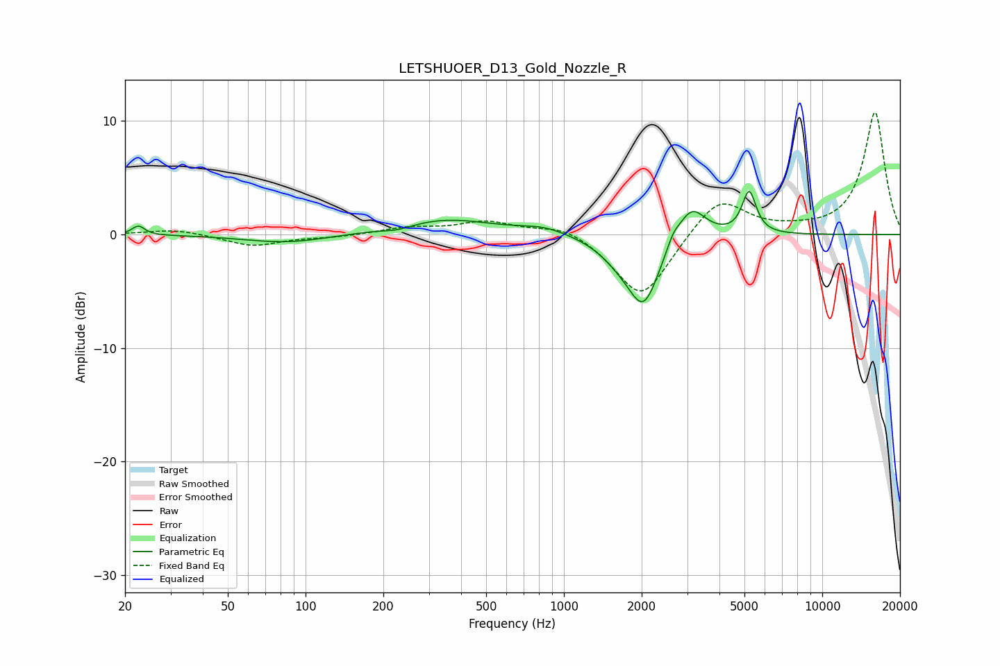

# LETSHUOER_D13_Gold_Nozzle_R
See [usage instructions](https://github.com/jaakkopasanen/AutoEq#usage) for more options and info.

### Parametric EQs
Apply preamp of -3.9 dB when using parametric equalizer.

|   # | Type    |   Fc (Hz) |    Q |   Gain (dB) |
|-----|---------|-----------|------|-------------|
|   1 | Peaking |        23 | 6    |         0.8 |
|   2 | Peaking |        85 | 0.86 |        -0.8 |
|   3 | Peaking |       227 | 2.4  |        -0.4 |
|   4 | Peaking |       348 | 0.75 |         1.4 |
|   5 | Peaking |       836 | 1.6  |         0.6 |
|   6 | Peaking |      1626 | 1.81 |        -1.2 |
|   7 | Peaking |      2036 | 2.28 |        -5.8 |
|   8 | Peaking |      2645 | 6    |         0.8 |
|   9 | Peaking |      3109 | 2.56 |         3   |
|  10 | Peaking |      5211 | 5.24 |         3.7 |

### Fixed Band EQs
When using fixed band (also called graphic) equalizer, apply preamp of **-10.8 dB** (if available) and set gains manually with these parameters.

|   # | Type    |   Fc (Hz) |    Q |   Gain (dB) |
|-----|---------|-----------|------|-------------|
|   1 | Peaking |        31 | 1.41 |         0.5 |
|   2 | Peaking |        62 | 1.41 |        -1   |
|   3 | Peaking |       125 | 1.41 |        -0.2 |
|   4 | Peaking |       250 | 1.41 |         0.6 |
|   5 | Peaking |       500 | 1.41 |         1.1 |
|   6 | Peaking |      1000 | 1.41 |         1   |
|   7 | Peaking |      2000 | 1.41 |        -5.8 |
|   8 | Peaking |      4000 | 1.41 |         3.5 |
|   9 | Peaking |      8000 | 1.41 |         0.2 |
|  10 | Peaking |     16000 | 1.41 |        10.8 |

### Graphs

