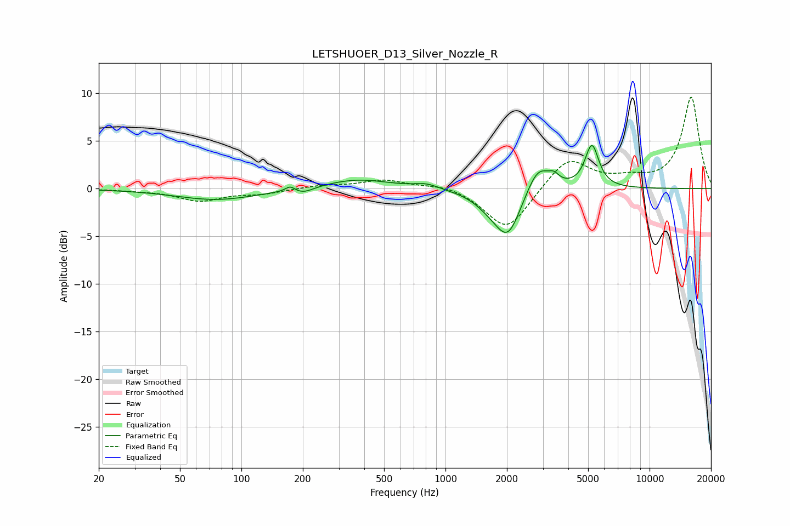

# LETSHUOER_D13_Silver_Nozzle_R
See [usage instructions](https://github.com/jaakkopasanen/AutoEq#usage) for more options and info.

### Parametric EQs
Apply preamp of -4.6 dB when using parametric equalizer.

|   # | Type    |   Fc (Hz) |    Q |   Gain (dB) |
|-----|---------|-----------|------|-------------|
|   1 | Peaking |        76 | 0.7  |        -1.2 |
|   2 | Peaking |       173 | 6    |         0.6 |
|   3 | Peaking |       201 | 2.94 |        -0.5 |
|   4 | Peaking |       368 | 0.88 |         1   |
|   5 | Peaking |       808 | 2.5  |         0.5 |
|   6 | Peaking |      1662 | 1.79 |        -1.2 |
|   7 | Peaking |      2029 | 2.23 |        -4.6 |
|   8 | Peaking |      2847 | 2.39 |         2.9 |
|   9 | Peaking |      3404 | 5.99 |         0.7 |
|  10 | Peaking |      5217 | 4.17 |         4.5 |

### Fixed Band EQs
When using fixed band (also called graphic) equalizer, apply preamp of **-9.7 dB** (if available) and set gains manually with these parameters.

|   # | Type    |   Fc (Hz) |    Q |   Gain (dB) |
|-----|---------|-----------|------|-------------|
|   1 | Peaking |        31 | 1.41 |        -0.1 |
|   2 | Peaking |        62 | 1.41 |        -1.2 |
|   3 | Peaking |       125 | 1.41 |        -0.5 |
|   4 | Peaking |       250 | 1.41 |         0.3 |
|   5 | Peaking |       500 | 1.41 |         0.9 |
|   6 | Peaking |      1000 | 1.41 |         0.5 |
|   7 | Peaking |      2000 | 1.41 |        -4.5 |
|   8 | Peaking |      4000 | 1.41 |         3.3 |
|   9 | Peaking |      8000 | 1.41 |         0.8 |
|  10 | Peaking |     16000 | 1.41 |         9.6 |

### Graphs

