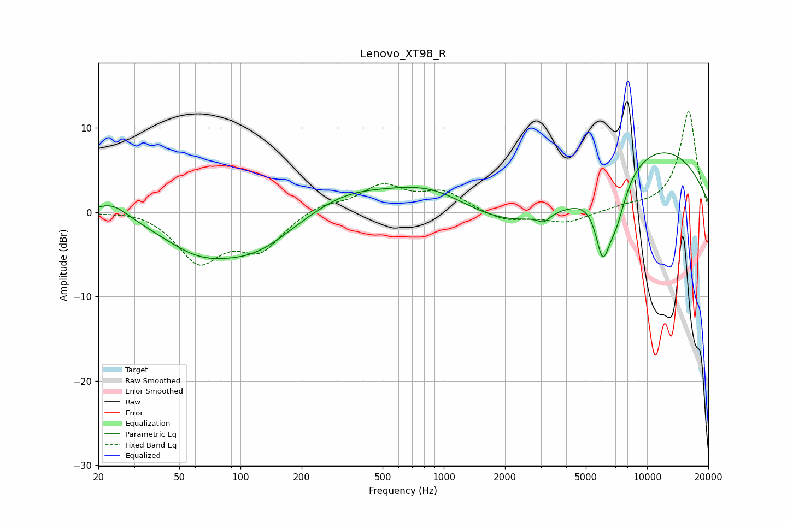

# Lenovo_XT98_R
See [usage instructions](https://github.com/jaakkopasanen/AutoEq#usage) for more options and info.

### Parametric EQs
Apply preamp of -7.1 dB when using parametric equalizer.

|   # | Type    |   Fc (Hz) |    Q |   Gain (dB) |
|-----|---------|-----------|------|-------------|
|   1 | Peaking |        23 | 1.71 |         1.8 |
|   2 | Peaking |        62 | 0.78 |        -3.8 |
|   3 | Peaking |       120 | 0.76 |        -3.7 |
|   4 | Peaking |       329 | 0.74 |         2.1 |
|   5 | Peaking |       887 | 0.61 |         4.6 |
|   6 | Peaking |      3101 | 5.09 |        -0.8 |
|   7 | Peaking |      3253 | 0.29 |        -6.5 |
|   8 | Peaking |      6040 | 3.82 |        -6.7 |
|   9 | Peaking |      7009 | 2.53 |        -5   |
|  10 | Peaking |      9008 | 0.31 |        10.7 |

### Fixed Band EQs
When using fixed band (also called graphic) equalizer, apply preamp of **-12.0 dB** (if available) and set gains manually with these parameters.

|   # | Type    |   Fc (Hz) |    Q |   Gain (dB) |
|-----|---------|-----------|------|-------------|
|   1 | Peaking |        31 | 1.41 |         0.5 |
|   2 | Peaking |        62 | 1.41 |        -5.6 |
|   3 | Peaking |       125 | 1.41 |        -4.1 |
|   4 | Peaking |       250 | 1.41 |         1   |
|   5 | Peaking |       500 | 1.41 |         3   |
|   6 | Peaking |      1000 | 1.41 |         2.2 |
|   7 | Peaking |      2000 | 1.41 |        -1.1 |
|   8 | Peaking |      4000 | 1.41 |        -1.3 |
|   9 | Peaking |      8000 | 1.41 |         0.5 |
|  10 | Peaking |     16000 | 1.41 |        12   |

### Graphs

