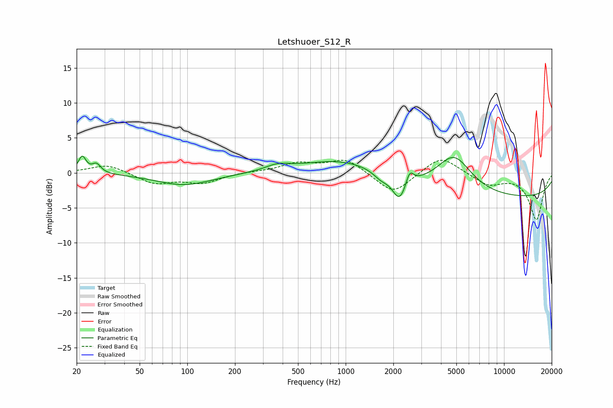

# Letshuoer_S12_R
See [usage instructions](https://github.com/jaakkopasanen/AutoEq#usage) for more options and info.

### Parametric EQs
Apply preamp of -2.5 dB when using parametric equalizer.

|   # | Type    |   Fc (Hz) |    Q |   Gain (dB) |
|-----|---------|-----------|------|-------------|
|   1 | Peaking |        22 | 5.9  |         2.3 |
|   2 | Peaking |        27 | 5.23 |         1.3 |
|   3 | Peaking |        95 | 0.8  |        -1.7 |
|   4 | Peaking |       372 | 1.86 |         0.8 |
|   5 | Peaking |       964 | 0.58 |         2.1 |
|   6 | Peaking |      1666 | 3.09 |        -0.9 |
|   7 | Peaking |      2187 | 3.23 |        -3.5 |
|   8 | Peaking |      2537 | 5.95 |         1.9 |
|   9 | Peaking |      4834 | 1.28 |         5.2 |
|  10 | Peaking |     10000 | 0.18 |        -3.6 |

### Fixed Band EQs
When using fixed band (also called graphic) equalizer, apply preamp of **-1.9 dB** (if available) and set gains manually with these parameters.

|   # | Type    |   Fc (Hz) |    Q |   Gain (dB) |
|-----|---------|-----------|------|-------------|
|   1 | Peaking |        31 | 1.41 |         1.3 |
|   2 | Peaking |        62 | 1.41 |        -1.5 |
|   3 | Peaking |       125 | 1.41 |        -1.4 |
|   4 | Peaking |       250 | 1.41 |         0.1 |
|   5 | Peaking |       500 | 1.41 |         1.3 |
|   6 | Peaking |      1000 | 1.41 |         2   |
|   7 | Peaking |      2000 | 1.41 |        -3.1 |
|   8 | Peaking |      4000 | 1.41 |         2.6 |
|   9 | Peaking |      8000 | 1.41 |        -1.7 |
|  10 | Peaking |     16000 | 1.41 |        -6.6 |

### Graphs

