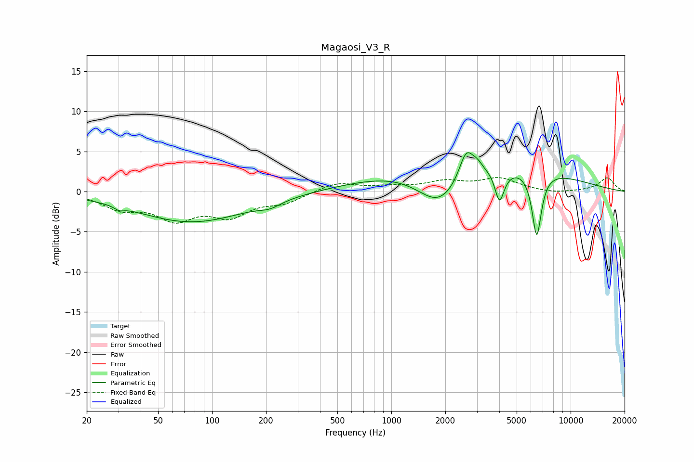

# Magaosi_V3_R
See [usage instructions](https://github.com/jaakkopasanen/AutoEq#usage) for more options and info.

### Parametric EQs
Apply preamp of -4.9 dB when using parametric equalizer.

|   # | Type    |   Fc (Hz) |    Q |   Gain (dB) |
|-----|---------|-----------|------|-------------|
|   1 | Peaking |        30 | 5.77 |        -0.4 |
|   2 | Peaking |        77 | 0.45 |        -3.8 |
|   3 | Peaking |       210 | 2.37 |        -0.7 |
|   4 | Peaking |      1855 | 1.1  |        -5   |
|   5 | Peaking |      2615 | 3.58 |         3.6 |
|   6 | Peaking |      2774 | 0.26 |         4.1 |
|   7 | Peaking |      3014 | 4.46 |         0.9 |
|   8 | Peaking |      4009 | 5.54 |        -3.9 |
|   9 | Peaking |      4426 | 4.06 |        -0.3 |
|  10 | Peaking |      6472 | 5.19 |        -8.2 |

### Fixed Band EQs
When using fixed band (also called graphic) equalizer, apply preamp of **-1.8 dB** (if available) and set gains manually with these parameters.

|   # | Type    |   Fc (Hz) |    Q |   Gain (dB) |
|-----|---------|-----------|------|-------------|
|   1 | Peaking |        31 | 1.41 |        -1.9 |
|   2 | Peaking |        62 | 1.41 |        -3.1 |
|   3 | Peaking |       125 | 1.41 |        -2.7 |
|   4 | Peaking |       250 | 1.41 |        -1.2 |
|   5 | Peaking |       500 | 1.41 |         1.2 |
|   6 | Peaking |      1000 | 1.41 |         0.5 |
|   7 | Peaking |      2000 | 1.41 |         1.1 |
|   8 | Peaking |      4000 | 1.41 |         1.5 |
|   9 | Peaking |      8000 | 1.41 |        -0.3 |
|  10 | Peaking |     16000 | 1.41 |         1.7 |

### Graphs

