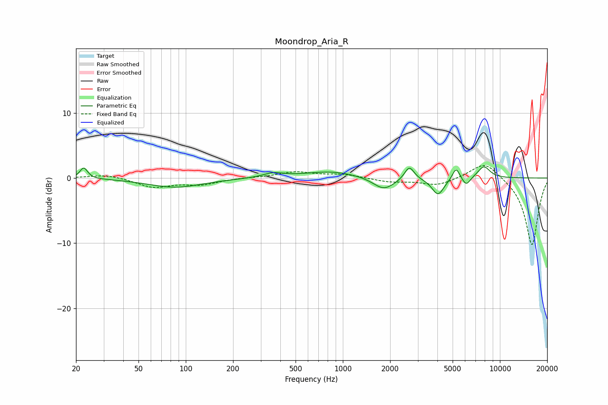

# Moondrop_Aria_R
See [usage instructions](https://github.com/jaakkopasanen/AutoEq#usage) for more options and info.

### Parametric EQs
Apply preamp of -1.8 dB when using parametric equalizer.

|   # | Type    |   Fc (Hz) |    Q |   Gain (dB) |
|-----|---------|-----------|------|-------------|
|   1 | Peaking |        22 | 5.93 |         1.7 |
|   2 | Peaking |        86 | 0.81 |        -1.4 |
|   3 | Peaking |       360 | 2.21 |         0.7 |
|   4 | Peaking |       845 | 0.85 |         1   |
|   5 | Peaking |      1825 | 2.06 |        -1.9 |
|   6 | Peaking |      2650 | 4.64 |         2.1 |
|   7 | Peaking |      4037 | 3.66 |        -2.6 |
|   8 | Peaking |      5259 | 5.99 |         1.9 |
|   9 | Peaking |      6106 | 5.37 |        -1.3 |
|  10 | Peaking |      7905 | 3.39 |         1.8 |

### Fixed Band EQs
When using fixed band (also called graphic) equalizer, apply preamp of **-2.0 dB** (if available) and set gains manually with these parameters.

|   # | Type    |   Fc (Hz) |    Q |   Gain (dB) |
|-----|---------|-----------|------|-------------|
|   1 | Peaking |        31 | 1.41 |         0.6 |
|   2 | Peaking |        62 | 1.41 |        -1.4 |
|   3 | Peaking |       125 | 1.41 |        -0.9 |
|   4 | Peaking |       250 | 1.41 |         0.1 |
|   5 | Peaking |       500 | 1.41 |         0.9 |
|   6 | Peaking |      1000 | 1.41 |         0.5 |
|   7 | Peaking |      2000 | 1.41 |        -0.6 |
|   8 | Peaking |      4000 | 1.41 |        -1.1 |
|   9 | Peaking |      8000 | 1.41 |         2.7 |
|  10 | Peaking |     16000 | 1.41 |       -10.4 |

### Graphs

