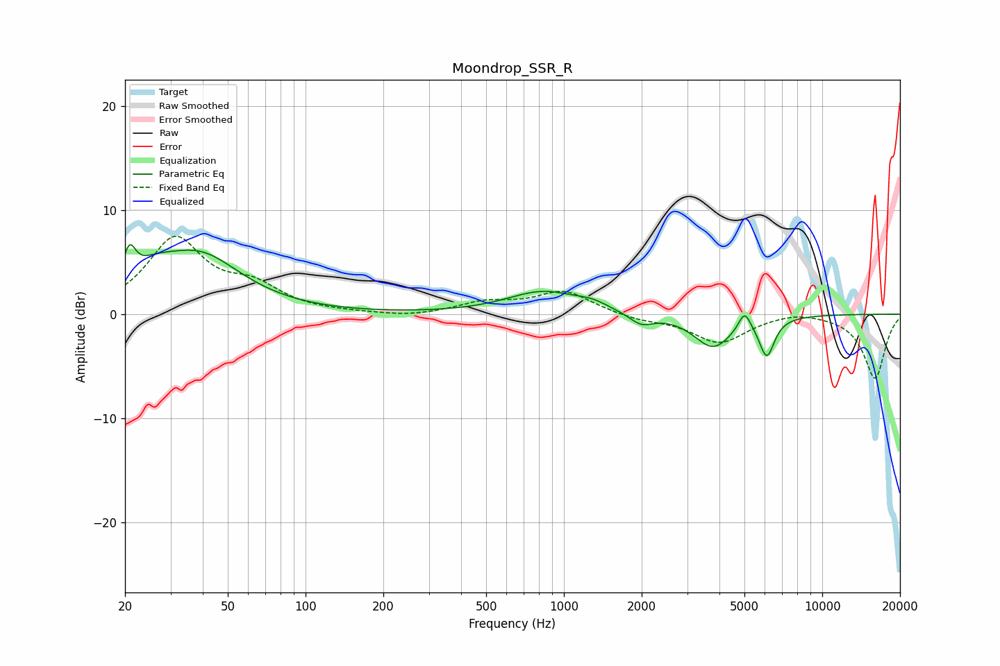

# Moondrop_SSR_R
See [usage instructions](https://github.com/jaakkopasanen/AutoEq#usage) for more options and info.

### Parametric EQs
Apply preamp of -6.7 dB when using parametric equalizer.

|   # | Type    |   Fc (Hz) |    Q |   Gain (dB) |
|-----|---------|-----------|------|-------------|
|   1 | Peaking |        21 | 5.85 |         3.1 |
|   2 | Peaking |        26 | 1.73 |         1.8 |
|   3 | Peaking |        39 | 0.87 |         5.4 |
|   4 | Peaking |       834 | 1.01 |         2.2 |
|   5 | Peaking |      1287 | 2.46 |         0.5 |
|   6 | Peaking |      1992 | 3.03 |        -1.1 |
|   7 | Peaking |      3777 | 1.89 |        -3.2 |
|   8 | Peaking |      5006 | 5.98 |         1.8 |
|   9 | Peaking |      6096 | 4.75 |        -3.3 |
|  10 | Peaking |      6173 | 5.11 |        -0.3 |

### Fixed Band EQs
When using fixed band (also called graphic) equalizer, apply preamp of **-7.6 dB** (if available) and set gains manually with these parameters.

|   # | Type    |   Fc (Hz) |    Q |   Gain (dB) |
|-----|---------|-----------|------|-------------|
|   1 | Peaking |        31 | 1.41 |         7.1 |
|   2 | Peaking |        62 | 1.41 |         2.2 |
|   3 | Peaking |       125 | 1.41 |         0   |
|   4 | Peaking |       250 | 1.41 |        -0.3 |
|   5 | Peaking |       500 | 1.41 |         1   |
|   6 | Peaking |      1000 | 1.41 |         2.2 |
|   7 | Peaking |      2000 | 1.41 |        -0.5 |
|   8 | Peaking |      4000 | 1.41 |        -2.7 |
|   9 | Peaking |      8000 | 1.41 |         0.4 |
|  10 | Peaking |     16000 | 1.41 |        -6.2 |

### Graphs

