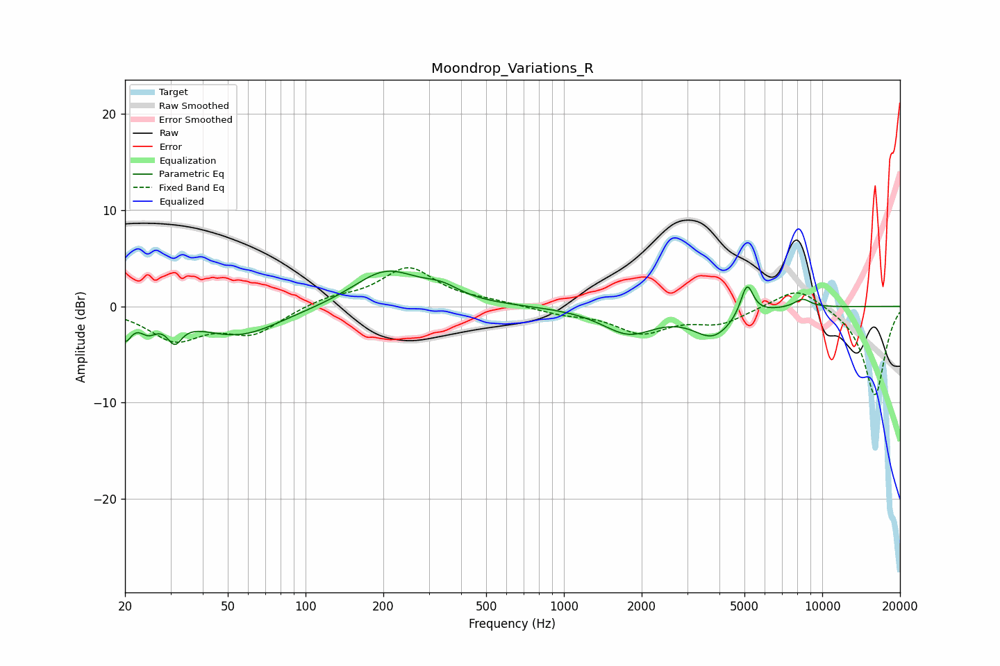

# Moondrop_Variations_R
See [usage instructions](https://github.com/jaakkopasanen/AutoEq#usage) for more options and info.

### Parametric EQs
Apply preamp of -3.7 dB when using parametric equalizer.

|   # | Type    |   Fc (Hz) |    Q |   Gain (dB) |
|-----|---------|-----------|------|-------------|
|   1 | Peaking |        20 | 6    |        -2.6 |
|   2 | Peaking |        25 | 4.23 |        -1.5 |
|   3 | Peaking |        31 | 5.17 |        -2.2 |
|   4 | Peaking |        55 | 0.86 |        -3.1 |
|   5 | Peaking |       204 | 1.11 |         3.7 |
|   6 | Peaking |       336 | 1.98 |         1.1 |
|   7 | Peaking |      1782 | 1.36 |        -2.7 |
|   8 | Peaking |      3781 | 1.8  |        -2.9 |
|   9 | Peaking |      5113 | 5.73 |         3.4 |
|  10 | Peaking |      8392 | 3.94 |         0.9 |

### Fixed Band EQs
When using fixed band (also called graphic) equalizer, apply preamp of **-4.1 dB** (if available) and set gains manually with these parameters.

|   # | Type    |   Fc (Hz) |    Q |   Gain (dB) |
|-----|---------|-----------|------|-------------|
|   1 | Peaking |        31 | 1.41 |        -3.3 |
|   2 | Peaking |        62 | 1.41 |        -2.6 |
|   3 | Peaking |       125 | 1.41 |         0.9 |
|   4 | Peaking |       250 | 1.41 |         3.9 |
|   5 | Peaking |       500 | 1.41 |         0.4 |
|   6 | Peaking |      1000 | 1.41 |        -0.7 |
|   7 | Peaking |      2000 | 1.41 |        -2.6 |
|   8 | Peaking |      4000 | 1.41 |        -1.6 |
|   9 | Peaking |      8000 | 1.41 |         2.2 |
|  10 | Peaking |     16000 | 1.41 |        -9.3 |

### Graphs

