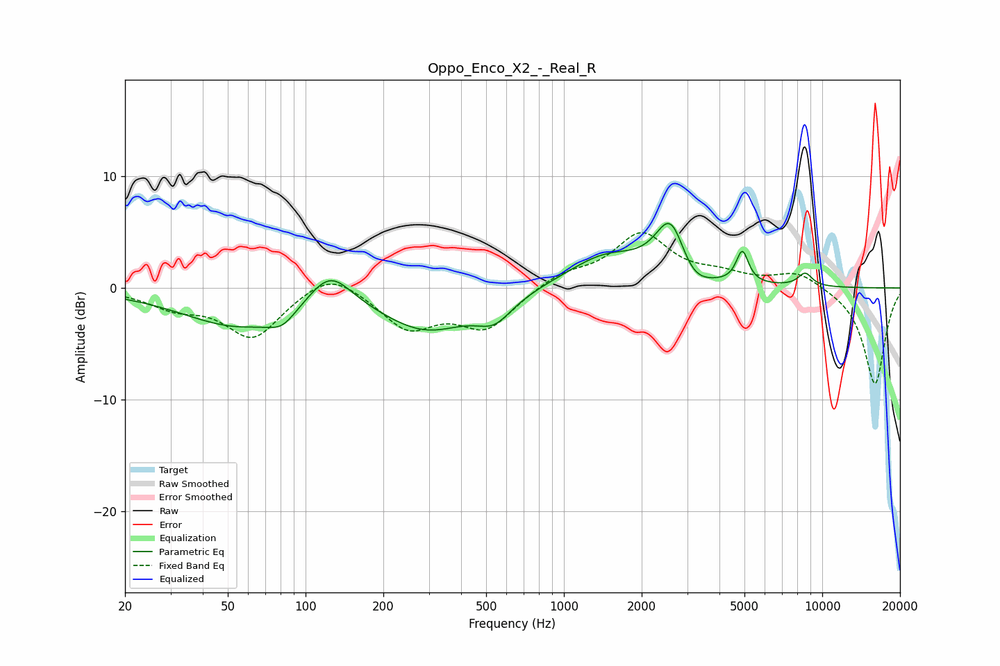

# Oppo_Enco_X2_-_Real_R
See [usage instructions](https://github.com/jaakkopasanen/AutoEq#usage) for more options and info.

### Parametric EQs
Apply preamp of -5.9 dB when using parametric equalizer.

|   # | Type    |   Fc (Hz) |    Q |   Gain (dB) |
|-----|---------|-----------|------|-------------|
|   1 | Peaking |        55 | 0.64 |        -3.4 |
|   2 | Peaking |        81 | 2.68 |        -1.2 |
|   3 | Peaking |       124 | 1.67 |         3.3 |
|   4 | Peaking |       295 | 0.81 |        -3.6 |
|   5 | Peaking |       538 | 2.02 |        -2   |
|   6 | Peaking |      1454 | 0.94 |         2.9 |
|   7 | Peaking |      2600 | 2.32 |         5.8 |
|   8 | Peaking |      3103 | 2.14 |        -2.1 |
|   9 | Peaking |      4905 | 6    |         2.9 |
|  10 | Peaking |      8588 | 4.6  |         1.2 |

### Fixed Band EQs
When using fixed band (also called graphic) equalizer, apply preamp of **-5.1 dB** (if available) and set gains manually with these parameters.

|   # | Type    |   Fc (Hz) |    Q |   Gain (dB) |
|-----|---------|-----------|------|-------------|
|   1 | Peaking |        31 | 1.41 |        -1.5 |
|   2 | Peaking |        62 | 1.41 |        -4.4 |
|   3 | Peaking |       125 | 1.41 |         1.9 |
|   4 | Peaking |       250 | 1.41 |        -3.4 |
|   5 | Peaking |       500 | 1.41 |        -3.5 |
|   6 | Peaking |      1000 | 1.41 |         1.2 |
|   7 | Peaking |      2000 | 1.41 |         4.7 |
|   8 | Peaking |      4000 | 1.41 |         0.9 |
|   9 | Peaking |      8000 | 1.41 |         1.5 |
|  10 | Peaking |     16000 | 1.41 |        -8.7 |

### Graphs

