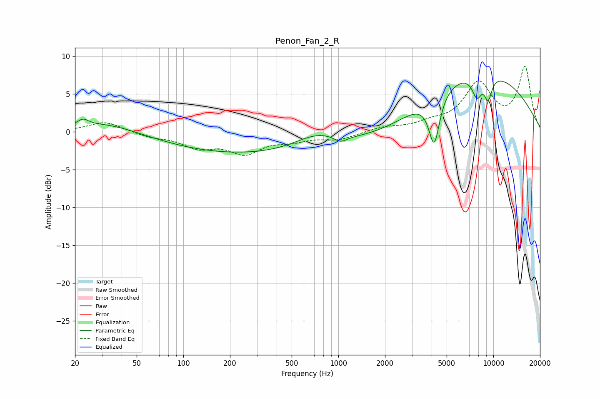

# Penon_Fan_2_R
See [usage instructions](https://github.com/jaakkopasanen/AutoEq#usage) for more options and info.

### Parametric EQs
Apply preamp of -6.8 dB when using parametric equalizer.

|   # | Type    |   Fc (Hz) |    Q |   Gain (dB) |
|-----|---------|-----------|------|-------------|
|   1 | Peaking |        22 | 3.9  |         0.9 |
|   2 | Peaking |        32 | 0.7  |         1.3 |
|   3 | Peaking |       390 | 0.18 |        -3.2 |
|   4 | Peaking |       733 | 0.91 |         2.2 |
|   5 | Peaking |      1033 | 3.39 |        -0.8 |
|   6 | Peaking |      2586 | 0.57 |        -1.7 |
|   7 | Peaking |      4156 | 3.99 |        -6.6 |
|   8 | Peaking |      7335 | 0.3  |         8.5 |
|   9 | Peaking |      7838 | 4.21 |        -2.8 |
|  10 | Peaking |      9261 | 5.17 |        -3   |

### Fixed Band EQs
When using fixed band (also called graphic) equalizer, apply preamp of **-8.7 dB** (if available) and set gains manually with these parameters.

|   # | Type    |   Fc (Hz) |    Q |   Gain (dB) |
|-----|---------|-----------|------|-------------|
|   1 | Peaking |        31 | 1.41 |         1.4 |
|   2 | Peaking |        62 | 1.41 |        -0.6 |
|   3 | Peaking |       125 | 1.41 |        -1.8 |
|   4 | Peaking |       250 | 1.41 |        -2.6 |
|   5 | Peaking |       500 | 1.41 |        -0.9 |
|   6 | Peaking |      1000 | 1.41 |        -1   |
|   7 | Peaking |      2000 | 1.41 |         0.6 |
|   8 | Peaking |      4000 | 1.41 |         0.9 |
|   9 | Peaking |      8000 | 1.41 |         6.1 |
|  10 | Peaking |     16000 | 1.41 |         8.3 |

### Graphs

