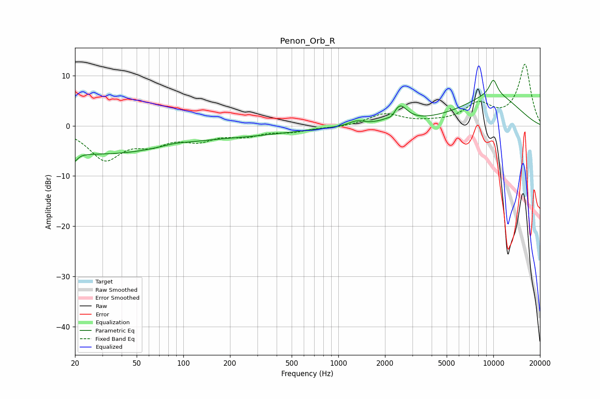

# Penon_Orb_R
See [usage instructions](https://github.com/jaakkopasanen/AutoEq#usage) for more options and info.

### Parametric EQs
Apply preamp of -9.2 dB when using parametric equalizer.

|   # | Type    |   Fc (Hz) |    Q |   Gain (dB) |
|-----|---------|-----------|------|-------------|
|   1 | Peaking |        20 | 5.51 |        -4.8 |
|   2 | Peaking |        20 | 5.52 |         3   |
|   3 | Peaking |        29 | 0.29 |        -5.5 |
|   4 | Peaking |        88 | 1.78 |         0.4 |
|   5 | Peaking |       269 | 0.44 |        -1.5 |
|   6 | Peaking |      1310 | 2.94 |         0.9 |
|   7 | Peaking |      2219 | 5.95 |        -0.9 |
|   8 | Peaking |      2484 | 2.99 |         3.5 |
|   9 | Peaking |     10000 | 4.62 |         3.1 |
|  10 | Peaking |     10000 | 0.6  |         6   |

### Fixed Band EQs
When using fixed band (also called graphic) equalizer, apply preamp of **-12.4 dB** (if available) and set gains manually with these parameters.

|   # | Type    |   Fc (Hz) |    Q |   Gain (dB) |
|-----|---------|-----------|------|-------------|
|   1 | Peaking |        31 | 1.41 |        -6.4 |
|   2 | Peaking |        62 | 1.41 |        -2.9 |
|   3 | Peaking |       125 | 1.41 |        -2.4 |
|   4 | Peaking |       250 | 1.41 |        -1.7 |
|   5 | Peaking |       500 | 1.41 |        -1   |
|   6 | Peaking |      1000 | 1.41 |        -0.3 |
|   7 | Peaking |      2000 | 1.41 |         2.3 |
|   8 | Peaking |      4000 | 1.41 |         0.4 |
|   9 | Peaking |      8000 | 1.41 |         4   |
|  10 | Peaking |     16000 | 1.41 |        12.1 |

### Graphs

