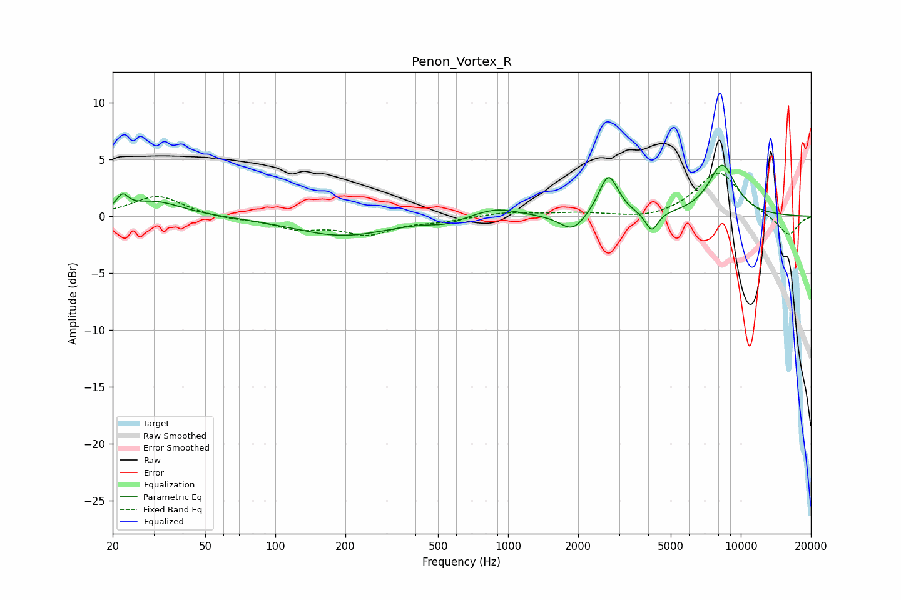

# Penon_Vortex_R
See [usage instructions](https://github.com/jaakkopasanen/AutoEq#usage) for more options and info.

### Parametric EQs
Apply preamp of -4.6 dB when using parametric equalizer.

|   # | Type    |   Fc (Hz) |    Q |   Gain (dB) |
|-----|---------|-----------|------|-------------|
|   1 | Peaking |        22 | 5.98 |         2.1 |
|   2 | Peaking |        22 | 5.99 |        -0.9 |
|   3 | Peaking |        30 | 1.2  |         1.3 |
|   4 | Peaking |       194 | 0.68 |        -1.7 |
|   5 | Peaking |       541 | 2.16 |        -0.5 |
|   6 | Peaking |       894 | 1.46 |         0.8 |
|   7 | Peaking |      1893 | 2.63 |        -1.5 |
|   8 | Peaking |      2700 | 3.42 |         3.7 |
|   9 | Peaking |      4140 | 5.19 |        -1.7 |
|  10 | Peaking |      8312 | 2.15 |         4.5 |

### Fixed Band EQs
When using fixed band (also called graphic) equalizer, apply preamp of **-3.9 dB** (if available) and set gains manually with these parameters.

|   # | Type    |   Fc (Hz) |    Q |   Gain (dB) |
|-----|---------|-----------|------|-------------|
|   1 | Peaking |        31 | 1.41 |         1.8 |
|   2 | Peaking |        62 | 1.41 |        -0.2 |
|   3 | Peaking |       125 | 1.41 |        -1   |
|   4 | Peaking |       250 | 1.41 |        -1.5 |
|   5 | Peaking |       500 | 1.41 |        -0.4 |
|   6 | Peaking |      1000 | 1.41 |         0.4 |
|   7 | Peaking |      2000 | 1.41 |         0.3 |
|   8 | Peaking |      4000 | 1.41 |        -0.3 |
|   9 | Peaking |      8000 | 1.41 |         3.9 |
|  10 | Peaking |     16000 | 1.41 |        -1.8 |

### Graphs

