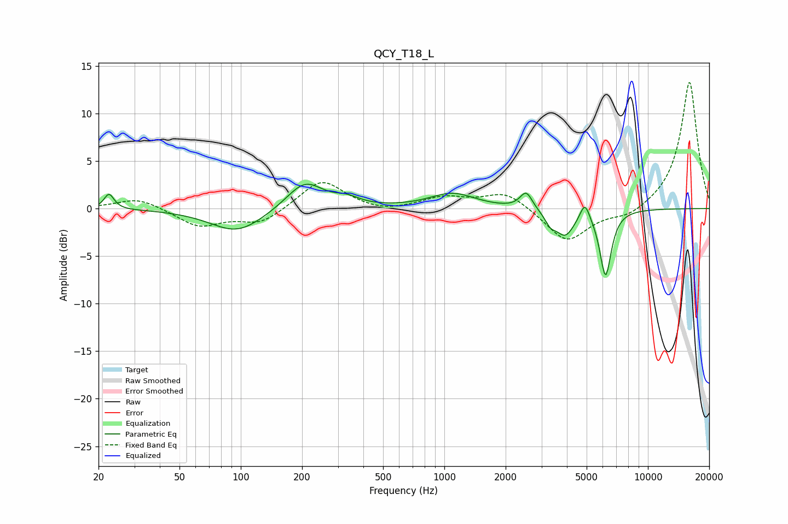

# QCY_T18_L
See [usage instructions](https://github.com/jaakkopasanen/AutoEq#usage) for more options and info.

### Parametric EQs
Apply preamp of -2.6 dB when using parametric equalizer.

|   # | Type    |   Fc (Hz) |    Q |   Gain (dB) |
|-----|---------|-----------|------|-------------|
|   1 | Peaking |        23 | 5.96 |         1.6 |
|   2 | Peaking |        96 | 1.08 |        -2.5 |
|   3 | Peaking |       206 | 1.57 |         3   |
|   4 | Peaking |       333 | 2.27 |         0.7 |
|   5 | Peaking |      1096 | 1.27 |         1.6 |
|   6 | Peaking |      2524 | 4.72 |         1.8 |
|   7 | Peaking |      3315 | 5.19 |        -1.1 |
|   8 | Peaking |      3921 | 3.03 |        -2.6 |
|   9 | Peaking |      4901 | 5.99 |         1.9 |
|  10 | Peaking |      6191 | 4.89 |        -7   |

### Fixed Band EQs
When using fixed band (also called graphic) equalizer, apply preamp of **-13.4 dB** (if available) and set gains manually with these parameters.

|   # | Type    |   Fc (Hz) |    Q |   Gain (dB) |
|-----|---------|-----------|------|-------------|
|   1 | Peaking |        31 | 1.41 |         1.2 |
|   2 | Peaking |        62 | 1.41 |        -1.9 |
|   3 | Peaking |       125 | 1.41 |        -1.6 |
|   4 | Peaking |       250 | 1.41 |         3.1 |
|   5 | Peaking |       500 | 1.41 |        -0.5 |
|   6 | Peaking |      1000 | 1.41 |         1.1 |
|   7 | Peaking |      2000 | 1.41 |         1.8 |
|   8 | Peaking |      4000 | 1.41 |        -3.6 |
|   9 | Peaking |      8000 | 1.41 |        -1   |
|  10 | Peaking |     16000 | 1.41 |        13.4 |

### Graphs

