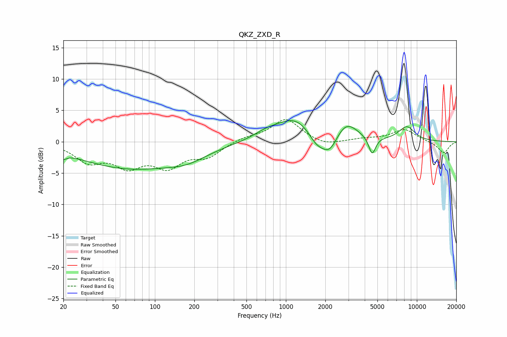

# QKZ_ZXD_R
See [usage instructions](https://github.com/jaakkopasanen/AutoEq#usage) for more options and info.

### Parametric EQs
Apply preamp of -3.5 dB when using parametric equalizer.

|   # | Type    |   Fc (Hz) |    Q |   Gain (dB) |
|-----|---------|-----------|------|-------------|
|   1 | Peaking |        20 | 5.75 |        -0.8 |
|   2 | Peaking |        65 | 0.35 |        -4.2 |
|   3 | Peaking |       177 | 0.95 |        -1.3 |
|   4 | Peaking |       715 | 1.35 |         1   |
|   5 | Peaking |      1194 | 1.01 |         3.6 |
|   6 | Peaking |      1706 | 2.23 |        -2   |
|   7 | Peaking |      2161 | 2.2  |        -3.2 |
|   8 | Peaking |      2870 | 1.61 |         3.1 |
|   9 | Peaking |      4558 | 5.38 |        -2.8 |
|  10 | Peaking |      8377 | 2.08 |         2.3 |

### Fixed Band EQs
When using fixed band (also called graphic) equalizer, apply preamp of **-3.6 dB** (if available) and set gains manually with these parameters.

|   # | Type    |   Fc (Hz) |    Q |   Gain (dB) |
|-----|---------|-----------|------|-------------|
|   1 | Peaking |        31 | 1.41 |        -2.9 |
|   2 | Peaking |        62 | 1.41 |        -3.4 |
|   3 | Peaking |       125 | 1.41 |        -3.5 |
|   4 | Peaking |       250 | 1.41 |        -2.1 |
|   5 | Peaking |       500 | 1.41 |         0.7 |
|   6 | Peaking |      1000 | 1.41 |         3.6 |
|   7 | Peaking |      2000 | 1.41 |        -0.7 |
|   8 | Peaking |      4000 | 1.41 |         0.4 |
|   9 | Peaking |      8000 | 1.41 |         2   |
|  10 | Peaking |     16000 | 1.41 |        -1.8 |

### Graphs

