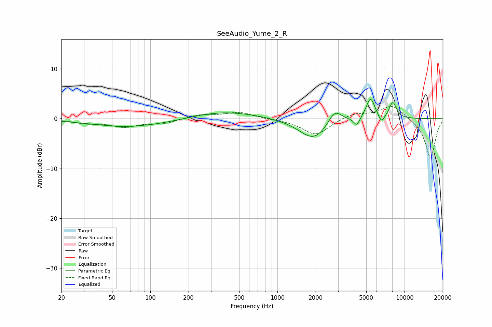

# SeeAudio_Yume_2_R
See [usage instructions](https://github.com/jaakkopasanen/AutoEq#usage) for more options and info.

### Parametric EQs
Apply preamp of -4.0 dB when using parametric equalizer.

|   # | Type    |   Fc (Hz) |    Q |   Gain (dB) |
|-----|---------|-----------|------|-------------|
|   1 | Peaking |        59 | 1.74 |        -0.1 |
|   2 | Peaking |        74 | 0.41 |        -1.6 |
|   3 | Peaking |       365 | 0.53 |         1.6 |
|   4 | Peaking |      1741 | 1.12 |        -0.9 |
|   5 | Peaking |      1958 | 1.33 |        -3.4 |
|   6 | Peaking |      2828 | 2.63 |         2.9 |
|   7 | Peaking |      4207 | 5.98 |        -1.7 |
|   8 | Peaking |      5402 | 4.04 |         4.2 |
|   9 | Peaking |      6586 | 5.99 |        -1.6 |
|  10 | Peaking |      8092 | 4.6  |         3.2 |

### Fixed Band EQs
When using fixed band (also called graphic) equalizer, apply preamp of **-2.5 dB** (if available) and set gains manually with these parameters.

|   # | Type    |   Fc (Hz) |    Q |   Gain (dB) |
|-----|---------|-----------|------|-------------|
|   1 | Peaking |        31 | 1.41 |        -0.8 |
|   2 | Peaking |        62 | 1.41 |        -1.5 |
|   3 | Peaking |       125 | 1.41 |        -0.9 |
|   4 | Peaking |       250 | 1.41 |         0.8 |
|   5 | Peaking |       500 | 1.41 |         1.3 |
|   6 | Peaking |      1000 | 1.41 |        -0.1 |
|   7 | Peaking |      2000 | 1.41 |        -3.3 |
|   8 | Peaking |      4000 | 1.41 |         1.1 |
|   9 | Peaking |      8000 | 1.41 |         2.8 |
|  10 | Peaking |     16000 | 1.41 |        -7.9 |

### Graphs

