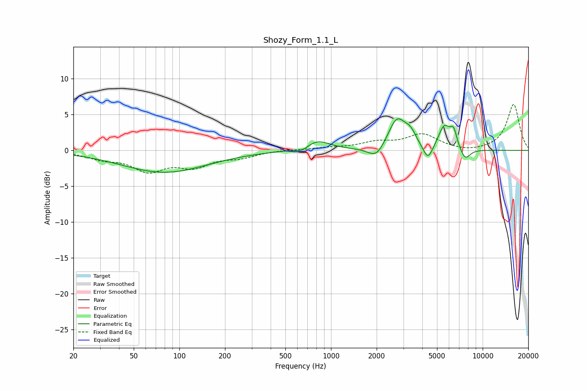

# Shozy_Form_1.1_L
See [usage instructions](https://github.com/jaakkopasanen/AutoEq#usage) for more options and info.

### Parametric EQs
Apply preamp of -4.5 dB when using parametric equalizer.

|   # | Type    |   Fc (Hz) |    Q |   Gain (dB) |
|-----|---------|-----------|------|-------------|
|   1 | Peaking |        80 | 0.5  |        -3   |
|   2 | Peaking |       645 | 3.12 |        -0.7 |
|   3 | Peaking |       807 | 1.68 |         1.5 |
|   4 | Peaking |      1994 | 2.6  |        -1.8 |
|   5 | Peaking |      2724 | 2.36 |         4.4 |
|   6 | Peaking |      3344 | 3.86 |         1.4 |
|   7 | Peaking |      4359 | 4.35 |        -2.3 |
|   8 | Peaking |      5581 | 3.55 |         3.2 |
|   9 | Peaking |      6432 | 6    |         2.2 |
|  10 | Peaking |      7661 | 3.96 |        -1.6 |

### Fixed Band EQs
When using fixed band (also called graphic) equalizer, apply preamp of **-6.5 dB** (if available) and set gains manually with these parameters.

|   # | Type    |   Fc (Hz) |    Q |   Gain (dB) |
|-----|---------|-----------|------|-------------|
|   1 | Peaking |        31 | 1.41 |        -1   |
|   2 | Peaking |        62 | 1.41 |        -2.6 |
|   3 | Peaking |       125 | 1.41 |        -2   |
|   4 | Peaking |       250 | 1.41 |        -0.8 |
|   5 | Peaking |       500 | 1.41 |         0.1 |
|   6 | Peaking |      1000 | 1.41 |         0.3 |
|   7 | Peaking |      2000 | 1.41 |         1   |
|   8 | Peaking |      4000 | 1.41 |         2.1 |
|   9 | Peaking |      8000 | 1.41 |        -0.3 |
|  10 | Peaking |     16000 | 1.41 |         6.4 |

### Graphs

