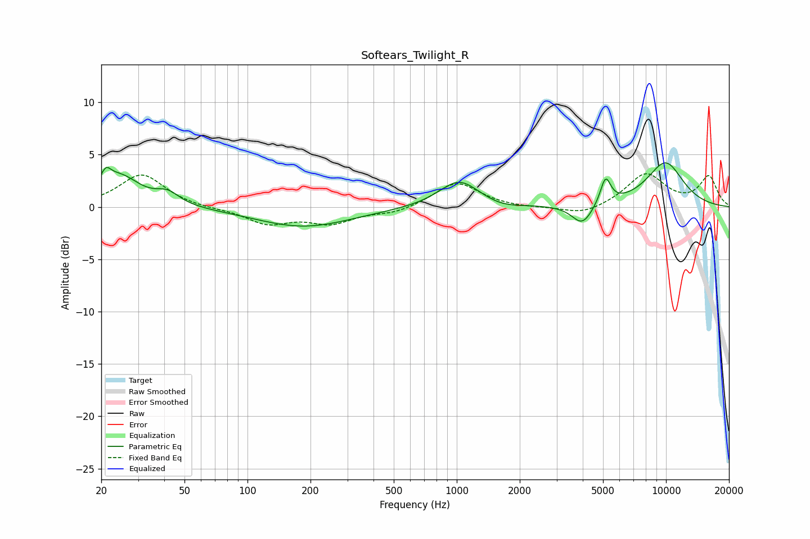

# Softears_Twilight_R
See [usage instructions](https://github.com/jaakkopasanen/AutoEq#usage) for more options and info.

### Parametric EQs
Apply preamp of -4.3 dB when using parametric equalizer.

|   # | Type    |   Fc (Hz) |    Q |   Gain (dB) |
|-----|---------|-----------|------|-------------|
|   1 | Peaking |        21 | 5.99 |        -1.9 |
|   2 | Peaking |        21 | 5.96 |         3.2 |
|   3 | Peaking |        24 | 1.46 |         2.9 |
|   4 | Peaking |        42 | 2.6  |         1.1 |
|   5 | Peaking |       185 | 0.61 |        -1.9 |
|   6 | Peaking |      1025 | 1.47 |         2.6 |
|   7 | Peaking |      1635 | 1.78 |        -0.4 |
|   8 | Peaking |      3980 | 2.84 |        -2   |
|   9 | Peaking |      5141 | 5.58 |         2.5 |
|  10 | Peaking |      9926 | 1.33 |         4.2 |

### Fixed Band EQs
When using fixed band (also called graphic) equalizer, apply preamp of **-3.3 dB** (if available) and set gains manually with these parameters.

|   # | Type    |   Fc (Hz) |    Q |   Gain (dB) |
|-----|---------|-----------|------|-------------|
|   1 | Peaking |        31 | 1.41 |         3.1 |
|   2 | Peaking |        62 | 1.41 |        -0.1 |
|   3 | Peaking |       125 | 1.41 |        -1.5 |
|   4 | Peaking |       250 | 1.41 |        -1.4 |
|   5 | Peaking |       500 | 1.41 |        -0.6 |
|   6 | Peaking |      1000 | 1.41 |         2.4 |
|   7 | Peaking |      2000 | 1.41 |        -0.1 |
|   8 | Peaking |      4000 | 1.41 |        -0.8 |
|   9 | Peaking |      8000 | 1.41 |         3.1 |
|  10 | Peaking |     16000 | 1.41 |         2.9 |

### Graphs

