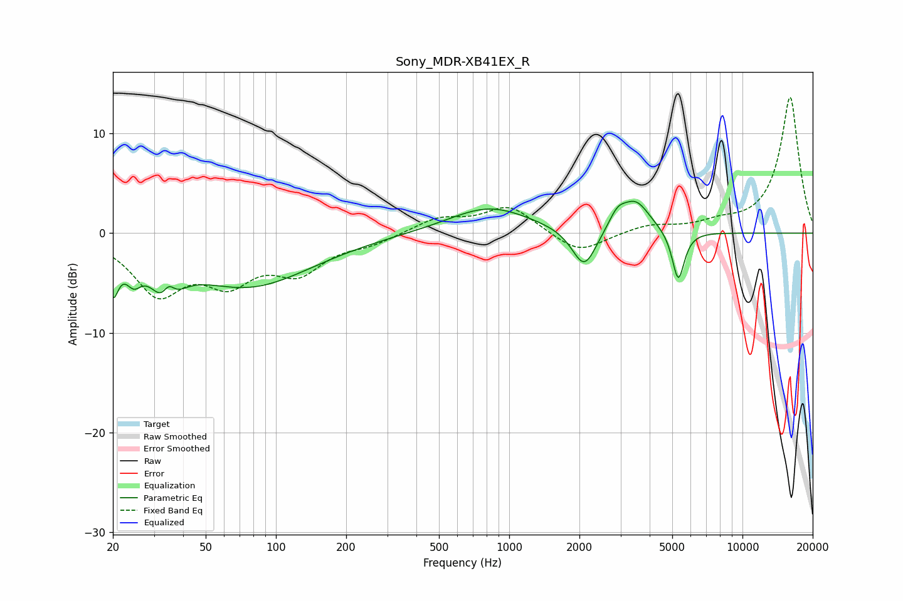

# Sony_MDR-XB41EX_R
See [usage instructions](https://github.com/jaakkopasanen/AutoEq#usage) for more options and info.

### Parametric EQs
Apply preamp of -3.3 dB when using parametric equalizer.

|   # | Type    |   Fc (Hz) |    Q |   Gain (dB) |
|-----|---------|-----------|------|-------------|
|   1 | Peaking |        20 | 5.95 |        -4.2 |
|   2 | Peaking |        25 | 4.23 |        -2.2 |
|   3 | Peaking |        34 | 2.67 |        -5.3 |
|   4 | Peaking |        35 | 4.93 |         3   |
|   5 | Peaking |        76 | 0.52 |        -5.3 |
|   6 | Peaking |       821 | 0.81 |         2.7 |
|   7 | Peaking |      2098 | 2.7  |        -4.1 |
|   8 | Peaking |      2908 | 3.73 |         1.6 |
|   9 | Peaking |      3492 | 2.29 |         3   |
|  10 | Peaking |      5305 | 5.34 |        -5.1 |

### Fixed Band EQs
When using fixed band (also called graphic) equalizer, apply preamp of **-13.7 dB** (if available) and set gains manually with these parameters.

|   # | Type    |   Fc (Hz) |    Q |   Gain (dB) |
|-----|---------|-----------|------|-------------|
|   1 | Peaking |        31 | 1.41 |        -5.7 |
|   2 | Peaking |        62 | 1.41 |        -4.1 |
|   3 | Peaking |       125 | 1.41 |        -3.5 |
|   4 | Peaking |       250 | 1.41 |        -0.9 |
|   5 | Peaking |       500 | 1.41 |         1.4 |
|   6 | Peaking |      1000 | 1.41 |         2.7 |
|   7 | Peaking |      2000 | 1.41 |        -2.1 |
|   8 | Peaking |      4000 | 1.41 |         0.8 |
|   9 | Peaking |      8000 | 1.41 |         0.8 |
|  10 | Peaking |     16000 | 1.41 |        13.7 |

### Graphs

