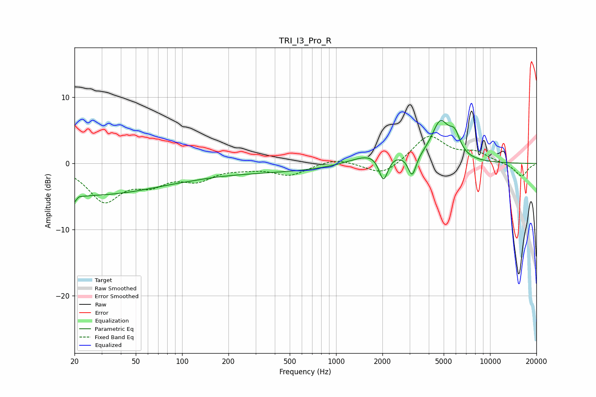

# TRI_I3_Pro_R
See [usage instructions](https://github.com/jaakkopasanen/AutoEq#usage) for more options and info.

### Parametric EQs
Apply preamp of -6.6 dB when using parametric equalizer.

|   # | Type    |   Fc (Hz) |    Q |   Gain (dB) |
|-----|---------|-----------|------|-------------|
|   1 | Peaking |        20 | 5.33 |        -4.1 |
|   2 | Peaking |        21 | 5.97 |         3.2 |
|   3 | Peaking |        25 | 0.31 |        -4.5 |
|   4 | Peaking |       116 | 1.93 |        -0.1 |
|   5 | Peaking |       342 | 0.19 |        -1.3 |
|   6 | Peaking |      1853 | 0.88 |         2.3 |
|   7 | Peaking |      2032 | 4.82 |        -4.1 |
|   8 | Peaking |      3120 | 5.49 |        -3.3 |
|   9 | Peaking |      4750 | 2.45 |         5.7 |
|  10 | Peaking |      5892 | 3.87 |         2.8 |

### Fixed Band EQs
When using fixed band (also called graphic) equalizer, apply preamp of **-4.2 dB** (if available) and set gains manually with these parameters.

|   # | Type    |   Fc (Hz) |    Q |   Gain (dB) |
|-----|---------|-----------|------|-------------|
|   1 | Peaking |        31 | 1.41 |        -5.4 |
|   2 | Peaking |        62 | 1.41 |        -2.5 |
|   3 | Peaking |       125 | 1.41 |        -2.2 |
|   4 | Peaking |       250 | 1.41 |        -0.5 |
|   5 | Peaking |       500 | 1.41 |        -1.7 |
|   6 | Peaking |      1000 | 1.41 |         0.9 |
|   7 | Peaking |      2000 | 1.41 |        -2   |
|   8 | Peaking |      4000 | 1.41 |         4.2 |
|   9 | Peaking |      8000 | 1.41 |         1.5 |
|  10 | Peaking |     16000 | 1.41 |        -2   |

### Graphs

