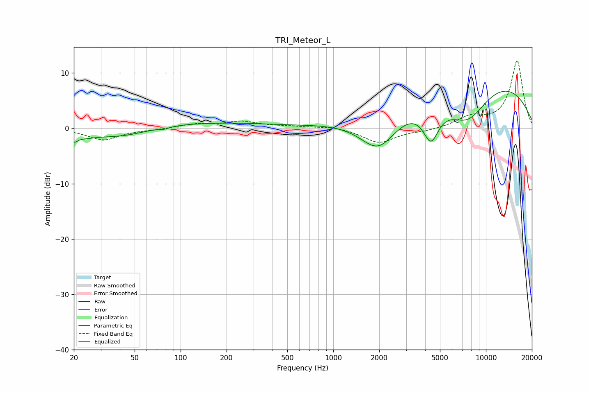

# TRI_Meteor_L
See [usage instructions](https://github.com/jaakkopasanen/AutoEq#usage) for more options and info.

### Parametric EQs
Apply preamp of -6.8 dB when using parametric equalizer.

|   # | Type    |   Fc (Hz) |    Q |   Gain (dB) |
|-----|---------|-----------|------|-------------|
|   1 | Peaking |        20 | 5.92 |        -1.3 |
|   2 | Peaking |        23 | 1.83 |        -0.9 |
|   3 | Peaking |        40 | 0.72 |        -2   |
|   4 | Peaking |        78 | 5.06 |        -0.3 |
|   5 | Peaking |       116 | 0.28 |         1.2 |
|   6 | Peaking |      1979 | 1.1  |        -7.3 |
|   7 | Peaking |      4363 | 2.67 |        -6.2 |
|   8 | Peaking |      5681 | 0.2  |         1.4 |
|   9 | Peaking |      7604 | 0.72 |       -12   |
|  10 | Peaking |      8288 | 0.3  |        13.2 |

### Fixed Band EQs
When using fixed band (also called graphic) equalizer, apply preamp of **-12.3 dB** (if available) and set gains manually with these parameters.

|   # | Type    |   Fc (Hz) |    Q |   Gain (dB) |
|-----|---------|-----------|------|-------------|
|   1 | Peaking |        31 | 1.41 |        -2.1 |
|   2 | Peaking |        62 | 1.41 |        -0.2 |
|   3 | Peaking |       125 | 1.41 |         0.7 |
|   4 | Peaking |       250 | 1.41 |         1.2 |
|   5 | Peaking |       500 | 1.41 |         0.3 |
|   6 | Peaking |      1000 | 1.41 |         0.4 |
|   7 | Peaking |      2000 | 1.41 |        -2.6 |
|   8 | Peaking |      4000 | 1.41 |        -0.4 |
|   9 | Peaking |      8000 | 1.41 |         1.9 |
|  10 | Peaking |     16000 | 1.41 |        12.2 |

### Graphs

