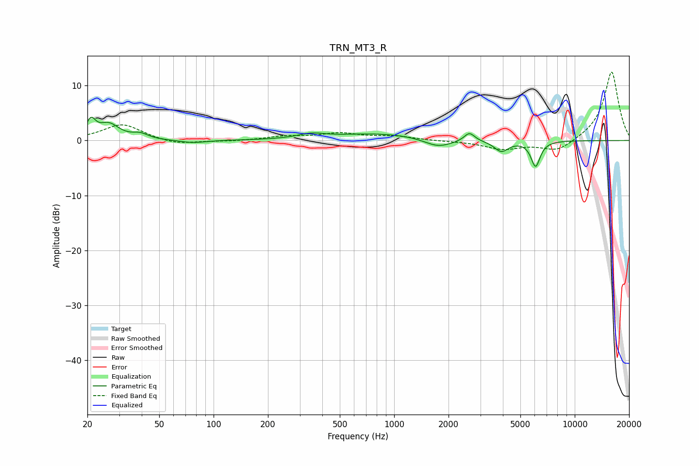

# TRN_MT3_R
See [usage instructions](https://github.com/jaakkopasanen/AutoEq#usage) for more options and info.

### Parametric EQs
Apply preamp of -4.3 dB when using parametric equalizer.

|   # | Type    |   Fc (Hz) |    Q |   Gain (dB) |
|-----|---------|-----------|------|-------------|
|   1 | Peaking |        21 | 5.72 |         2.9 |
|   2 | Peaking |        26 | 2.45 |         2.8 |
|   3 | Peaking |        39 | 3.35 |         0.9 |
|   4 | Peaking |        77 | 1.98 |        -0.5 |
|   5 | Peaking |       348 | 1.91 |         0.8 |
|   6 | Peaking |       845 | 0.56 |         1.3 |
|   7 | Peaking |      1753 | 1.79 |        -1.6 |
|   8 | Peaking |      2609 | 4.98 |         1.6 |
|   9 | Peaking |      3921 | 3.63 |        -2   |
|  10 | Peaking |      6069 | 5.47 |        -4.6 |

### Fixed Band EQs
When using fixed band (also called graphic) equalizer, apply preamp of **-12.6 dB** (if available) and set gains manually with these parameters.

|   # | Type    |   Fc (Hz) |    Q |   Gain (dB) |
|-----|---------|-----------|------|-------------|
|   1 | Peaking |        31 | 1.41 |         3   |
|   2 | Peaking |        62 | 1.41 |        -0.8 |
|   3 | Peaking |       125 | 1.41 |        -0.2 |
|   4 | Peaking |       250 | 1.41 |         0.7 |
|   5 | Peaking |       500 | 1.41 |         1.2 |
|   6 | Peaking |      1000 | 1.41 |         0.7 |
|   7 | Peaking |      2000 | 1.41 |        -0.1 |
|   8 | Peaking |      4000 | 1.41 |        -1.5 |
|   9 | Peaking |      8000 | 1.41 |        -2.1 |
|  10 | Peaking |     16000 | 1.41 |        12.7 |

### Graphs

