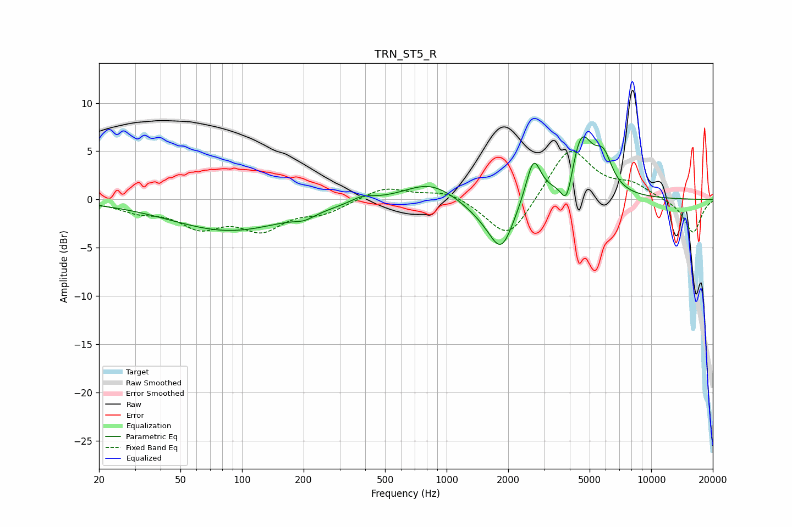

# TRN_ST5_R
See [usage instructions](https://github.com/jaakkopasanen/AutoEq#usage) for more options and info.

### Parametric EQs
Apply preamp of -6.6 dB when using parametric equalizer.

|   # | Type    |   Fc (Hz) |    Q |   Gain (dB) |
|-----|---------|-----------|------|-------------|
|   1 | Peaking |        87 | 0.49 |        -3.2 |
|   2 | Peaking |       202 | 2.77 |        -0.6 |
|   3 | Peaking |       387 | 2.54 |         0.6 |
|   4 | Peaking |       828 | 1.14 |         1.9 |
|   5 | Peaking |      1519 | 1.4  |        -1.2 |
|   6 | Peaking |      1854 | 2.34 |        -4.8 |
|   7 | Peaking |      2656 | 3.82 |         4.5 |
|   8 | Peaking |      3876 | 4.64 |        -3.7 |
|   9 | Peaking |      4535 | 2.45 |         6.6 |
|  10 | Peaking |      5845 | 3.22 |         3.2 |

### Fixed Band EQs
When using fixed band (also called graphic) equalizer, apply preamp of **-5.1 dB** (if available) and set gains manually with these parameters.

|   # | Type    |   Fc (Hz) |    Q |   Gain (dB) |
|-----|---------|-----------|------|-------------|
|   1 | Peaking |        31 | 1.41 |        -1   |
|   2 | Peaking |        62 | 1.41 |        -2.5 |
|   3 | Peaking |       125 | 1.41 |        -2.8 |
|   4 | Peaking |       250 | 1.41 |        -1.2 |
|   5 | Peaking |       500 | 1.41 |         1.3 |
|   6 | Peaking |      1000 | 1.41 |         1   |
|   7 | Peaking |      2000 | 1.41 |        -4.4 |
|   8 | Peaking |      4000 | 1.41 |         5.5 |
|   9 | Peaking |      8000 | 1.41 |         1.4 |
|  10 | Peaking |     16000 | 1.41 |        -3.5 |

### Graphs

