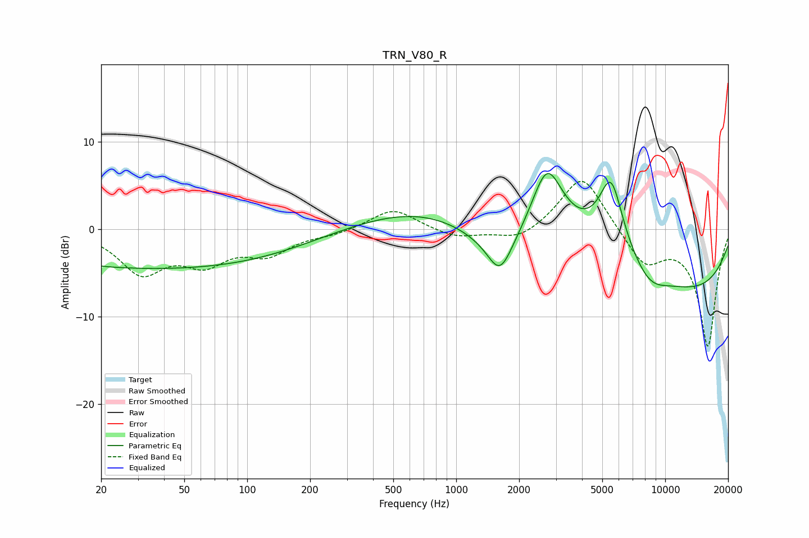

# TRN_V80_R
See [usage instructions](https://github.com/jaakkopasanen/AutoEq#usage) for more options and info.

### Parametric EQs
Apply preamp of -6.5 dB when using parametric equalizer.

|   # | Type    |   Fc (Hz) |    Q |   Gain (dB) |
|-----|---------|-----------|------|-------------|
|   1 | Peaking |        20 | 1.3  |        -0.1 |
|   2 | Peaking |        42 | 0.19 |        -4.5 |
|   3 | Peaking |       865 | 0.23 |         1.3 |
|   4 | Peaking |      1618 | 2.45 |        -4.1 |
|   5 | Peaking |      1648 | 0.57 |        -7.6 |
|   6 | Peaking |      2719 | 1.8  |         8.4 |
|   7 | Peaking |      3009 | 0.21 |         8.4 |
|   8 | Peaking |      5506 | 2.34 |         8.3 |
|   9 | Peaking |      8378 | 1.51 |        -2.2 |
|  10 | Peaking |      9109 | 0.25 |       -10.6 |

### Fixed Band EQs
When using fixed band (also called graphic) equalizer, apply preamp of **-5.6 dB** (if available) and set gains manually with these parameters.

|   # | Type    |   Fc (Hz) |    Q |   Gain (dB) |
|-----|---------|-----------|------|-------------|
|   1 | Peaking |        31 | 1.41 |        -4.7 |
|   2 | Peaking |        62 | 1.41 |        -3.3 |
|   3 | Peaking |       125 | 1.41 |        -2.5 |
|   4 | Peaking |       250 | 1.41 |        -0.5 |
|   5 | Peaking |       500 | 1.41 |         2.4 |
|   6 | Peaking |      1000 | 1.41 |        -1   |
|   7 | Peaking |      2000 | 1.41 |        -1.4 |
|   8 | Peaking |      4000 | 1.41 |         6.5 |
|   9 | Peaking |      8000 | 1.41 |        -4   |
|  10 | Peaking |     16000 | 1.41 |       -13.3 |

### Graphs

