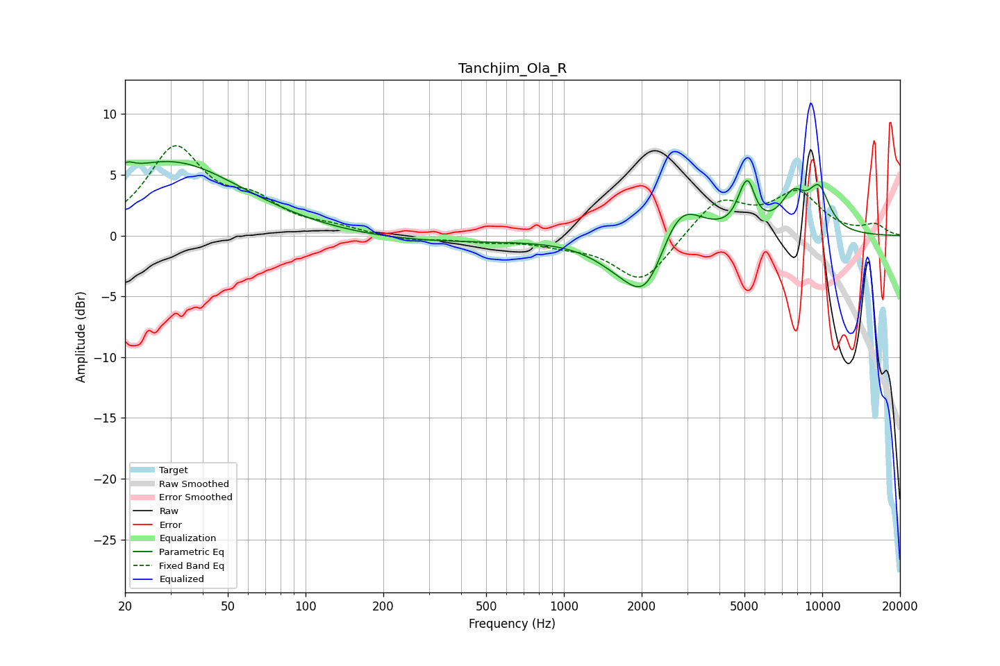

# Tanchjim_Ola_R
See [usage instructions](https://github.com/jaakkopasanen/AutoEq#usage) for more options and info.

### Parametric EQs
Apply preamp of -6.2 dB when using parametric equalizer.

|   # | Type    |   Fc (Hz) |    Q |   Gain (dB) |
|-----|---------|-----------|------|-------------|
|   1 | Peaking |        20 | 4.85 |         0.9 |
|   2 | Peaking |        30 | 0.51 |         6.1 |
|   3 | Peaking |       303 | 0.4  |        -0.6 |
|   4 | Peaking |      1636 | 1.27 |        -1.5 |
|   5 | Peaking |      2080 | 1.76 |        -4.7 |
|   6 | Peaking |      2797 | 1.67 |         3.8 |
|   7 | Peaking |      4903 | 4.66 |         1.4 |
|   8 | Peaking |      5184 | 5.21 |         2.7 |
|   9 | Peaking |      7716 | 2.65 |         2.8 |
|  10 | Peaking |      9708 | 2.86 |         3.3 |

### Fixed Band EQs
When using fixed band (also called graphic) equalizer, apply preamp of **-7.5 dB** (if available) and set gains manually with these parameters.

|   # | Type    |   Fc (Hz) |    Q |   Gain (dB) |
|-----|---------|-----------|------|-------------|
|   1 | Peaking |        31 | 1.41 |         7   |
|   2 | Peaking |        62 | 1.41 |         2.3 |
|   3 | Peaking |       125 | 1.41 |         0.5 |
|   4 | Peaking |       250 | 1.41 |        -0.4 |
|   5 | Peaking |       500 | 1.41 |        -0.4 |
|   6 | Peaking |      1000 | 1.41 |        -0.6 |
|   7 | Peaking |      2000 | 1.41 |        -3.9 |
|   8 | Peaking |      4000 | 1.41 |         3   |
|   9 | Peaking |      8000 | 1.41 |         3.3 |
|  10 | Peaking |     16000 | 1.41 |         0.8 |

### Graphs

