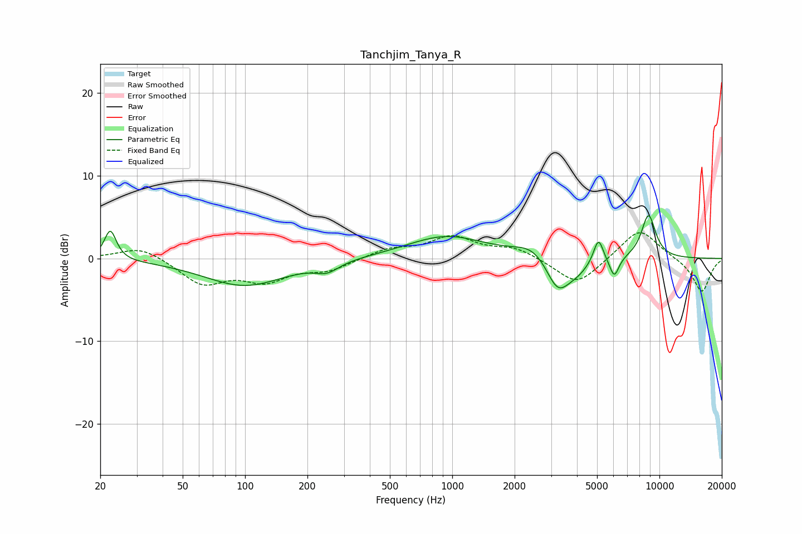

# Tanchjim_Tanya_R
See [usage instructions](https://github.com/jaakkopasanen/AutoEq#usage) for more options and info.

### Parametric EQs
Apply preamp of -5.3 dB when using parametric equalizer.

|   # | Type    |   Fc (Hz) |    Q |   Gain (dB) |
|-----|---------|-----------|------|-------------|
|   1 | Peaking |        22 | 4.98 |         3.6 |
|   2 | Peaking |       100 | 0.72 |        -3.3 |
|   3 | Peaking |       249 | 2.51 |        -1.1 |
|   4 | Peaking |       934 | 0.75 |         2.7 |
|   5 | Peaking |      2467 | 1.68 |         1.6 |
|   6 | Peaking |      3228 | 2.41 |        -4.1 |
|   7 | Peaking |      4003 | 2.21 |        -1.3 |
|   8 | Peaking |      5077 | 5.88 |         3   |
|   9 | Peaking |      6052 | 5.99 |        -2.5 |
|  10 | Peaking |      8855 | 3.65 |         5.3 |

### Fixed Band EQs
When using fixed band (also called graphic) equalizer, apply preamp of **-3.2 dB** (if available) and set gains manually with these parameters.

|   # | Type    |   Fc (Hz) |    Q |   Gain (dB) |
|-----|---------|-----------|------|-------------|
|   1 | Peaking |        31 | 1.41 |         1.5 |
|   2 | Peaking |        62 | 1.41 |        -3   |
|   3 | Peaking |       125 | 1.41 |        -2.4 |
|   4 | Peaking |       250 | 1.41 |        -1.3 |
|   5 | Peaking |       500 | 1.41 |         1.1 |
|   6 | Peaking |      1000 | 1.41 |         2.5 |
|   7 | Peaking |      2000 | 1.41 |         1.2 |
|   8 | Peaking |      4000 | 1.41 |        -3.3 |
|   9 | Peaking |      8000 | 1.41 |         3.7 |
|  10 | Peaking |     16000 | 1.41 |        -4.1 |

### Graphs

